# Luma 引擎架构设计

- [返回主文档](README.md)
- [English Version](ARCHITECTURE_EN.md)

---

## 整体架构

下图示意引擎的模块化分层与数据流。

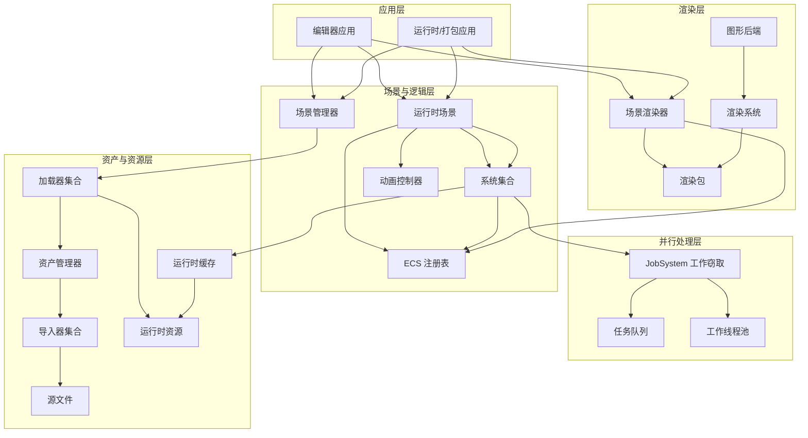

---

## 核心系统数据流

### 资产管线

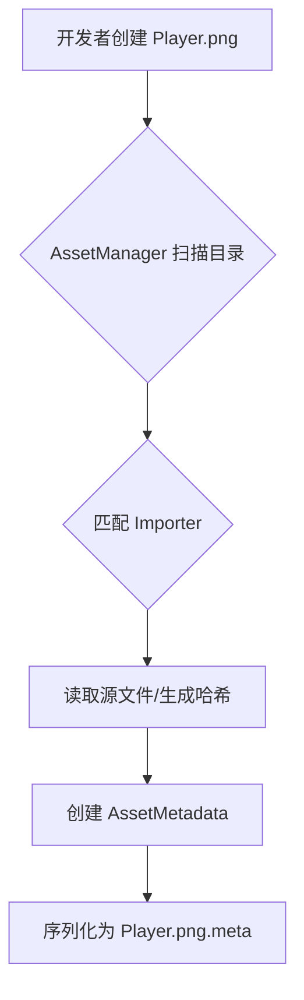

### 运行时资源加载

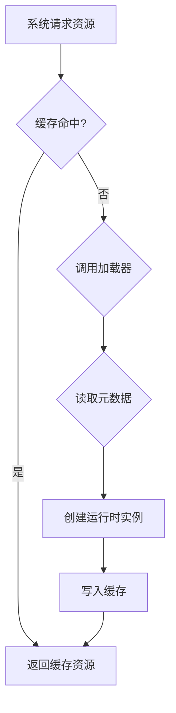

### 场景实例化

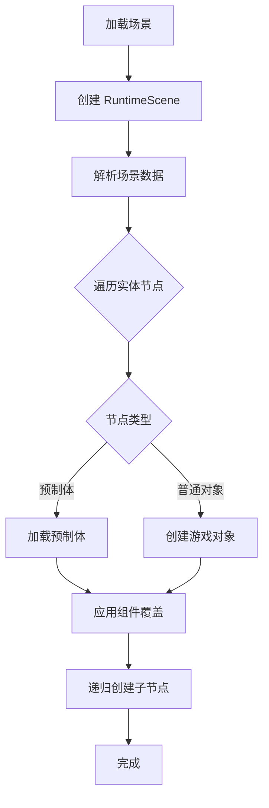

### 脚本系统互操作

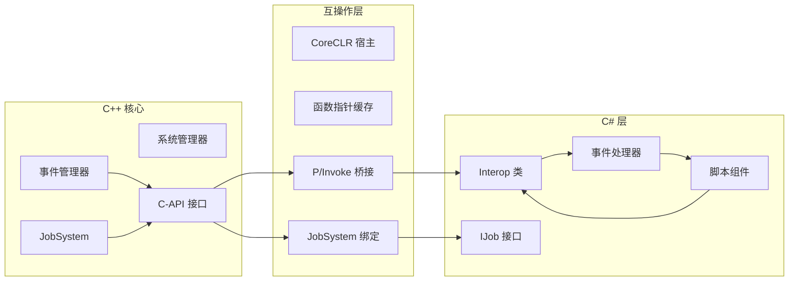

### 物理更新循环

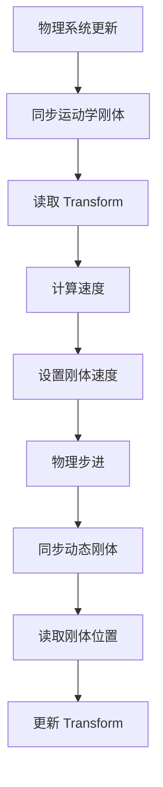

### 渲染管线

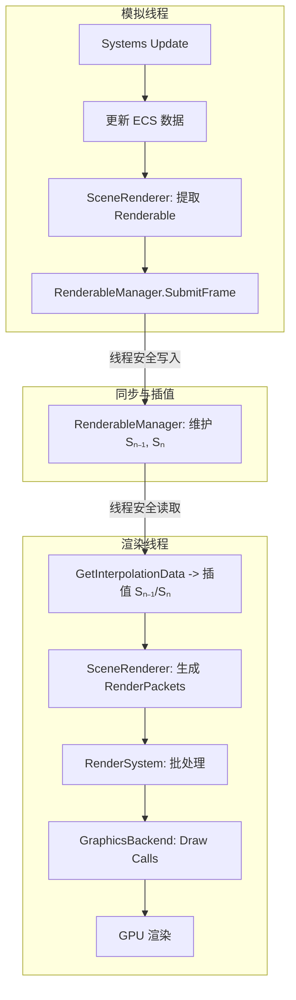

### Tilemap 系统

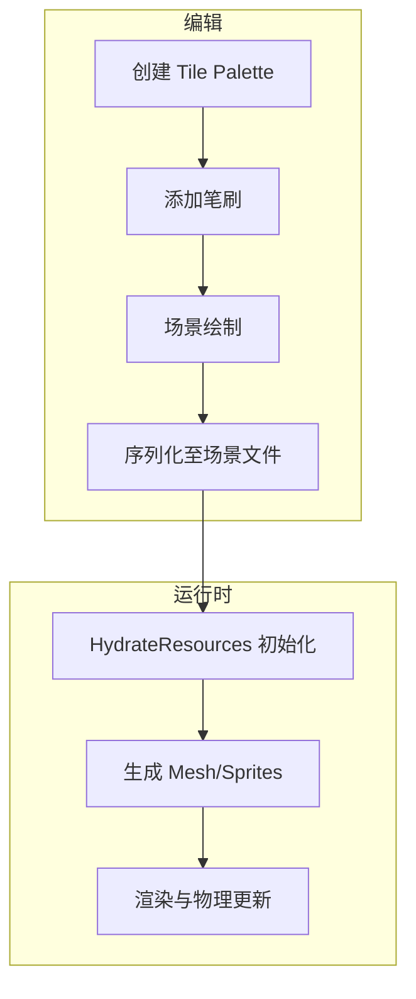

### 音频系统

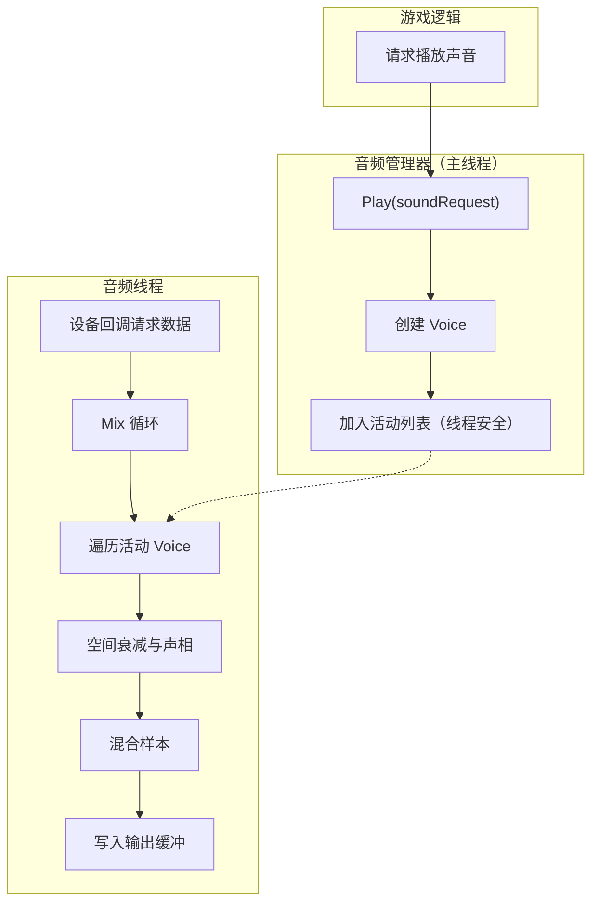

### JobSystem 并行处理

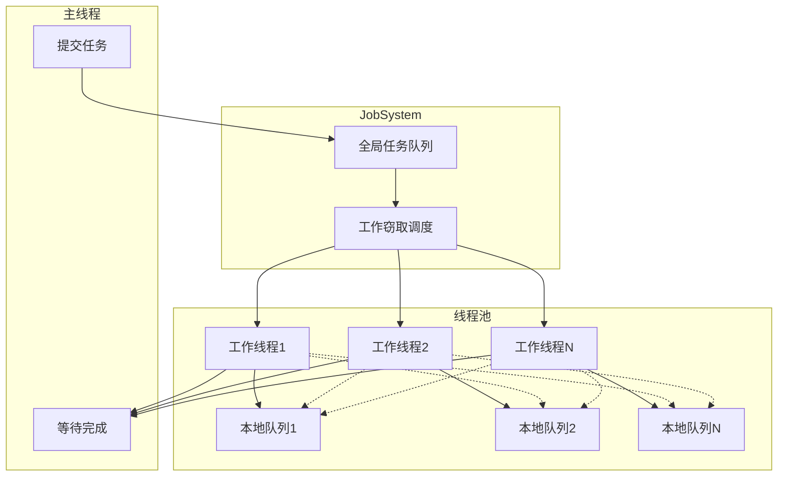

### 动画状态机

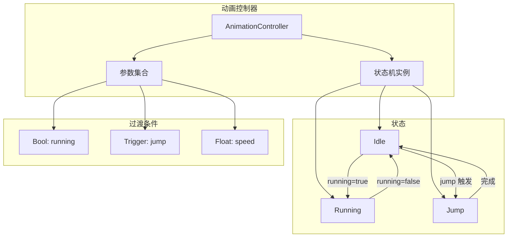

---

## 实施建议

- **线程安全**：渲染数据提交与读取使用双缓冲或帧队列，避免竞争。  
- **确定性**：固定物理步长与时间同步策略，确保回放与网络一致性。  
- **可测性**：关键系统（资产、渲染、物理、JobSystem）提供可视化 Profiling 与统计接口。  
- **演进性**：模块接口稳定，允许后端替换（例如图形后端从 Skia/Dawn 迁移至其他实现）。

---

## Android 支持（arm64）

- External 预编译包：
  - `External/mono-android-arm64`（.NET 9 Mono，含 `DotNetRuntimeConfig.cmake`）
  - `External/skia-android`（Skia 静态库，仅 arm64）
- CMake：
  - Android 自动切换到 `DotNet::Mono`；桌面平台使用 `DotNet::Host`。
  - Android 不强制查找 Vulkan/OpenSSL，优先 GLES/EGL（Skia 链接静态库）。
- 代码：
  - `Scripting/ManagedHost.h` 在 Android 采用 `MonoHost`（与 `CoreCLRHost` 统一 API）。
  - `Luma_CAPI` 暴露 `Engine_InitWithANativeWindow/Engine_Frame/Engine_Shutdown` 供 Java 层调用。
- Android 工程：
  - `Android/app/src/main/cpp/CMakeLists.txt` 引入引擎根目录并链接 `LumaEngine`。
  - Gradle 任务将 Mono 运行时与 Skia 运行时库复制到 `src/main/jniLibs/arm64-v8a`：
    - `External/mono-android-arm64/bin/*.so`
    - `External/skia-android/bin/*.so`（如 Dawn/webgpu 运行时，若使用）
    - 同时打包 `External/skia-android/bin/icudtl.dat` 至 APK 资源（文本排版所需）
  - 默认启用脚本（Mono），不再定义 `LUMA_DISABLE_SCRIPTING`。
