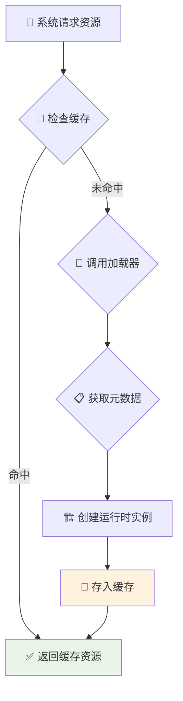
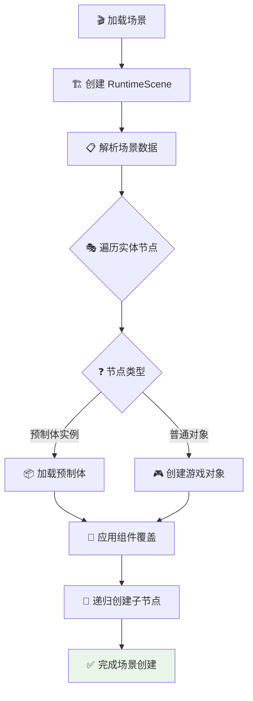
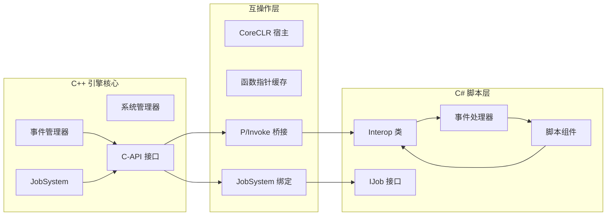
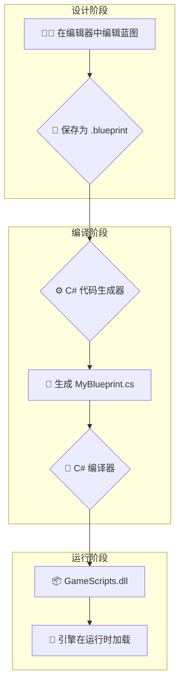
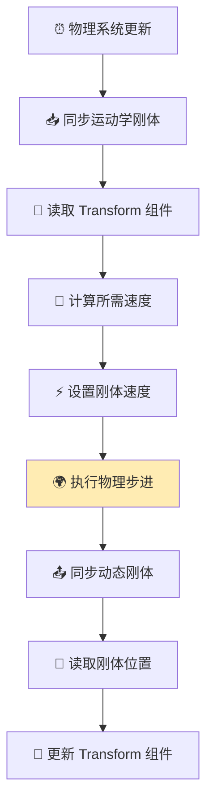
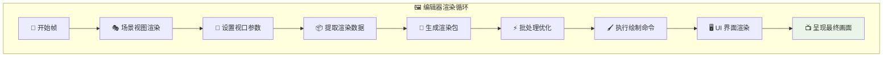
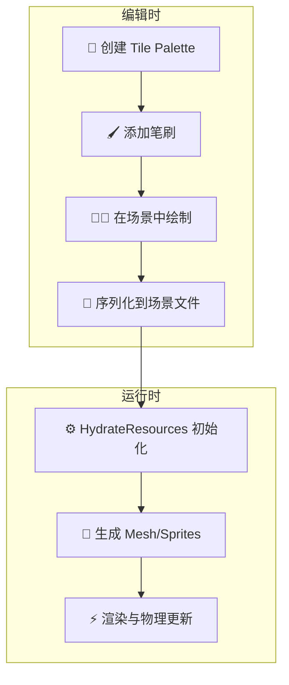
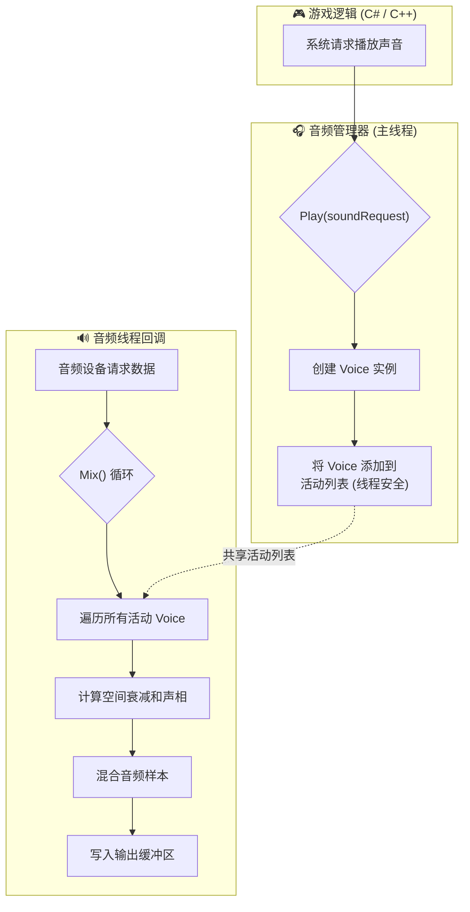
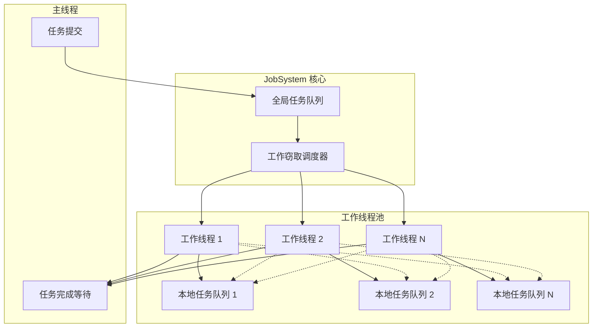
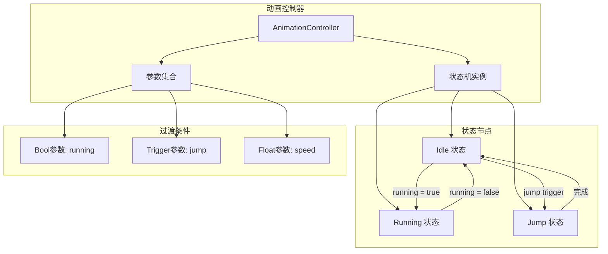

# Luma 引擎 - 架构设计详解

本文档详细阐述了 Luma 引擎的核心架构和主要系统的数据流图。

[返回主文档 (Return to Main Document)](README.md)

---

## 🏗️ 整体架构

下图展示了 Luma 引擎的模块化架构和数据流：

```mermaid
graph TD
    subgraph "🎮 应用层"
        Editor[编辑器应用]
        Runtime[运行时/打包应用]
    end

    subgraph "🎭 场景与逻辑层"
        SceneManager[场景管理器]
        RuntimeScene[运行时场景]
        Systems[系统集合]
        Registry[ECS 注册表]
        AnimController[动画控制器]
        RuntimeScene --> Systems
        RuntimeScene --> Registry
        RuntimeScene --> AnimController
    end

    subgraph "⚙️ 并行处理层"
        JobSystem[JobSystem 工作窃取]
        TaskQueue[任务队列]
        WorkerThreads[工作线程池]
        JobSystem --> TaskQueue
        JobSystem --> WorkerThreads
    end

    subgraph "📦 资产与资源层"
        AssetManager[资产管理器]
        Importers[导入器集合]
        Loaders[加载器集合]
        RuntimeCaches[运行时缓存]
        SourceFiles[源文件]
        RuntimeAssets[运行时资源]
        AssetManager --> Importers
        Importers --> SourceFiles
        Loaders --> AssetManager
        Loaders --> RuntimeAssets
        RuntimeCaches --> RuntimeAssets
    end

    subgraph "🎨 渲染层"
        SceneRenderer[场景渲染器]
        RenderSystem[渲染系统]
        GraphicsBackend[图形后端]
        RenderPackets[渲染包]
        SceneRenderer --> RenderPackets
        RenderSystem --> RenderPackets
        GraphicsBackend --> RenderSystem
    end

    Editor --> SceneManager
    Runtime --> SceneManager
    Editor --> RuntimeScene
    Runtime --> RuntimeScene
    RuntimeScene --> Systems
    Systems --> Registry
    Systems --> RuntimeCaches
    Systems --> JobSystem
    SceneManager --> Loaders
    Editor --> SceneRenderer
    Runtime --> SceneRenderer
    SceneRenderer --> Registry
````

-----

## ⚙️ 核心系统数据流

### 📦 资产管线工作流 (Asset Pipeline Workflow)

```mermaid
graph TD
    A[👨‍💻 开发者创建<br/>Player.png] --> B{🔍 AssetManager<br/>扫描目录}
B --> C{🔧 匹配 Importer}
C --> D[📖 读取源文件<br/>提取数据和哈希]
D --> E[📋 创建 AssetMetadata]
E --> F[💾 序列化为<br/>Player.png.meta]

style A fill:#e1f5fe
style F fill: #e8f5e8
```

### 💾 运行时资源加载 (Runtime Resource Loading)



### 🎭 场景实例化 (Scene Instantiation)



### 🔗 脚本系统互操作 (Scripting System Interop)



### ✨ 可视化蓝图系统 (Visual Blueprint System)



### ⚡ 物理更新循环 (Physics Update Loop)



### 🎨 渲染管线 (Render Pipeline)



### 🧩 Tilemap 系统 (Tilemap System)



### 🔊 音频系统 (Audio System)



### ⚙️ JobSystem 并行处理 (JobSystem Parallel Processing)



### 🎬 动画状态机 (Animation State Machine)



-----

[⬆️ 返回主文档 (Return to Main Document)](README.md)