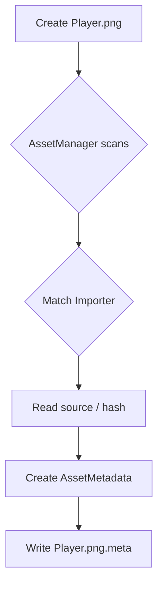
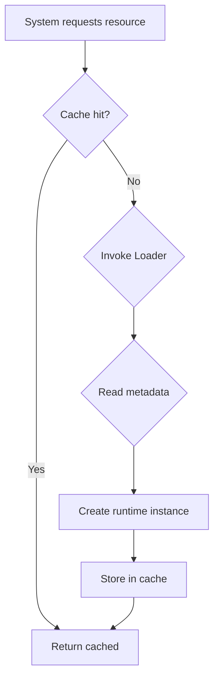
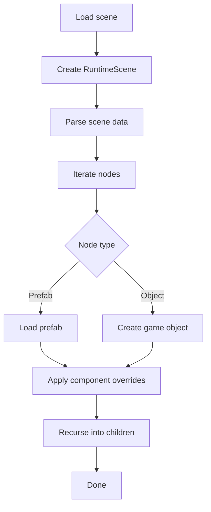
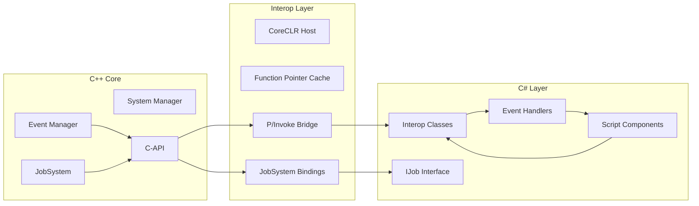
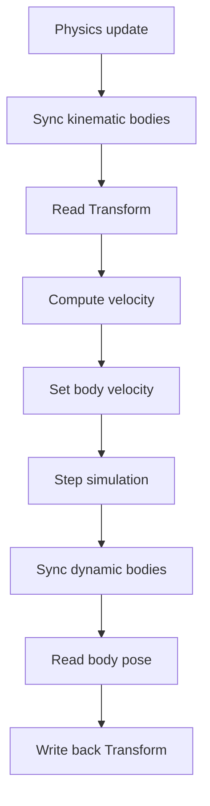
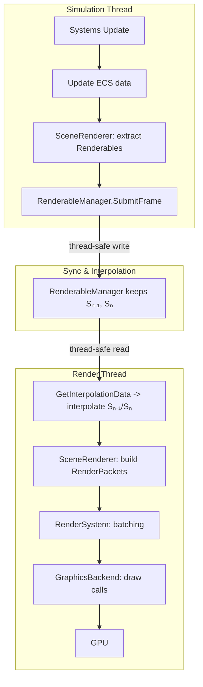
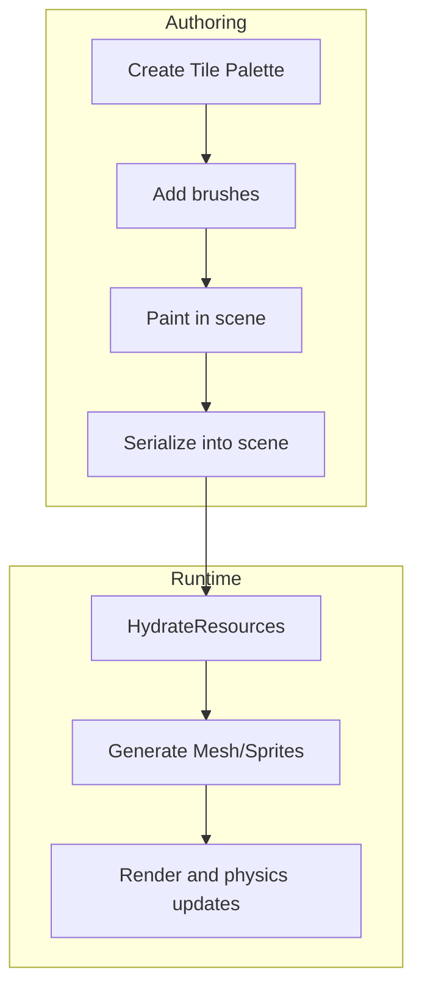
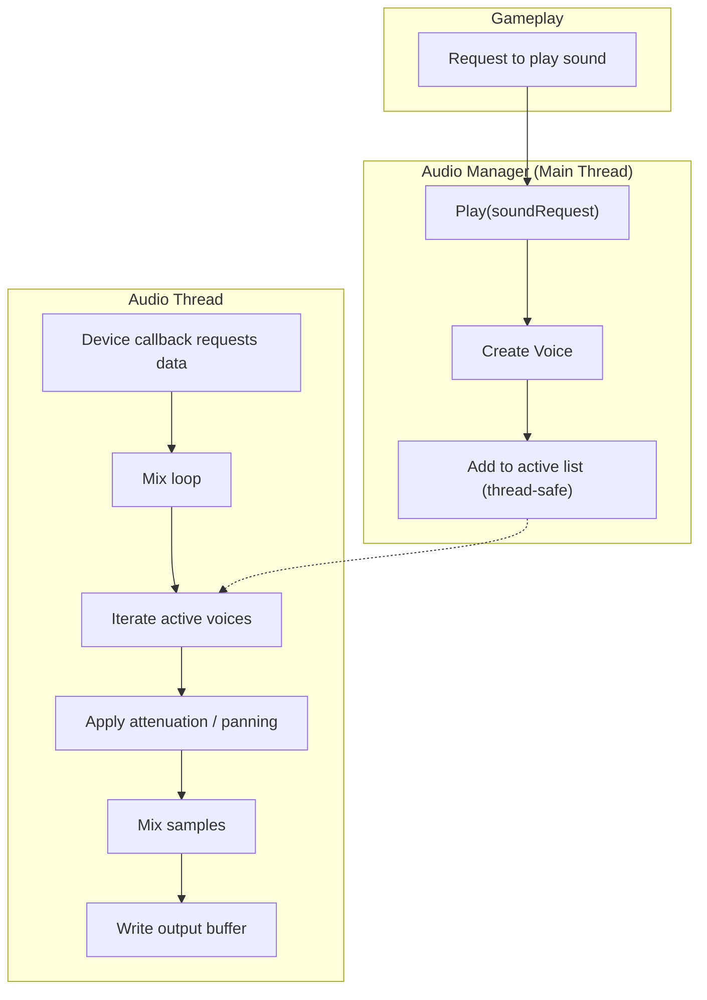
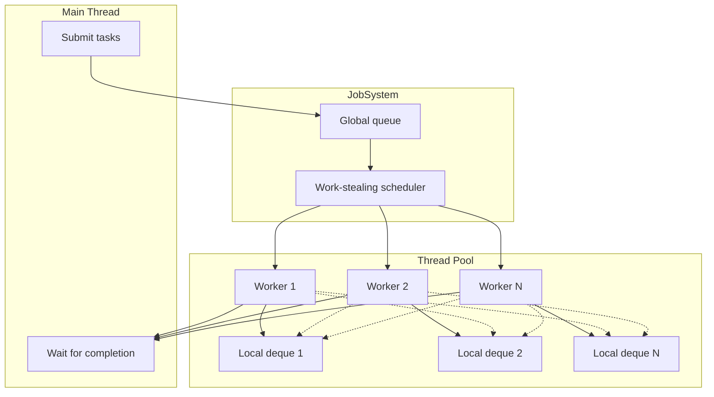
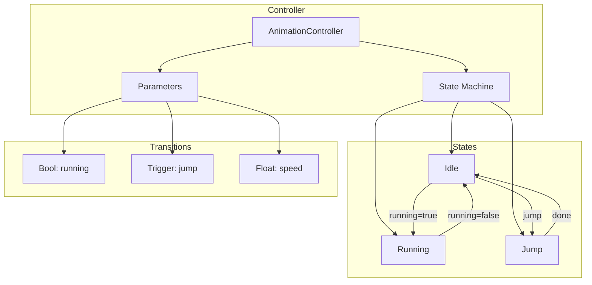

# Luma Architecture

- [Back to README](README_EN.md)
- [中文文档](ARCHITECTURE.md)

---

## High‑Level Architecture

The following diagram outlines the modular layers and primary data flows.

```mermaid
graph TD
    subgraph "Application"
        Editor[Editor]
        Runtime[Runtime/Packaged App]
    end

    subgraph "Scene & Logic"
        SceneManager[Scene Manager]
        RuntimeScene[Runtime Scene]
        Systems[Systems]
        Registry[ECS Registry]
        AnimController[Animation Controller]
        RuntimeScene --> Systems
        RuntimeScene --> Registry
        RuntimeScene --> AnimController
    end

    subgraph "Parallel Processing"
        JobSystem[JobSystem (work‑stealing)]
        TaskQueue[Task Queue]
        WorkerThreads[Worker Thread Pool]
        JobSystem --> TaskQueue
        JobSystem --> WorkerThreads
    end

    subgraph "Assets & Resources"
        AssetManager[Asset Manager]
        Importers[Importers]
        Loaders[Loaders]
        RuntimeCaches[Caches]
        SourceFiles[Source Files]
        RuntimeAssets[Runtime Assets]
        AssetManager --> Importers
        Importers --> SourceFiles
        Loaders --> AssetManager
        Loaders --> RuntimeAssets
        RuntimeCaches --> RuntimeAssets
    end

    subgraph "Rendering"
        SceneRenderer[Scene Renderer]
        RenderSystem[Render System]
        GraphicsBackend[Graphics Backend]
        RenderPackets[Render Packets]
        SceneRenderer --> RenderPackets
        RenderSystem --> RenderPackets
        GraphicsBackend --> RenderSystem
    end

    Editor --> SceneManager
    Runtime --> SceneManager
    Editor --> RuntimeScene
    Runtime --> RuntimeScene
    RuntimeScene --> Systems
    Systems --> Registry
    Systems --> RuntimeCaches
    Systems --> JobSystem
    SceneManager --> Loaders
    Editor --> SceneRenderer
    Runtime --> SceneRenderer
    SceneRenderer --> Registry
```

---

## Core Data Flows

### Asset Pipeline



### Runtime Resource Loading



### Scene Instantiation



### Scripting Interop



### Physics Update Loop



### Render Pipeline



### Tilemap System



### Audio System



### JobSystem Parallel Processing



### Animation State Machine



---

## Implementation Notes

- **Thread safety**: double‑buffering or frame queues for submission/reads to avoid contention.  
- **Determinism**: fixed physics timestep and consistent time sync for replay/network parity.  
- **Observability**: profiling and counters across assets, rendering, physics, and JobSystem.  
- **Evolvability**: stable module interfaces to allow backend swaps (e.g., alternative graphics backends).
