# Luma Engine - Architecture Design Details

[Return to Main Document](README_EN.md)

---

## 🏗️ Overall Architecture

The diagram below shows the modular architecture and data flow of the Luma Engine:

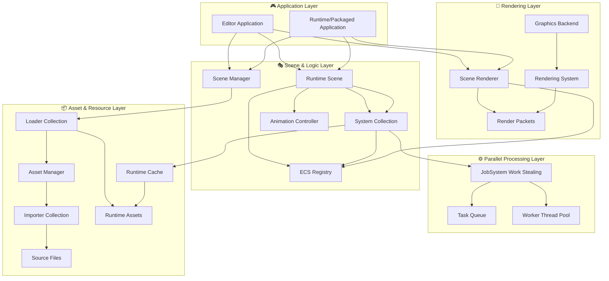

-----

## ⚙️ Core System Data Flow

### 📦 Asset Pipeline Workflow

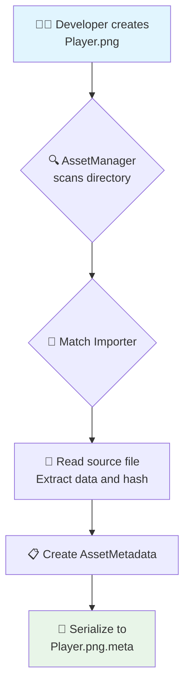

### 💾 Runtime Resource Loading

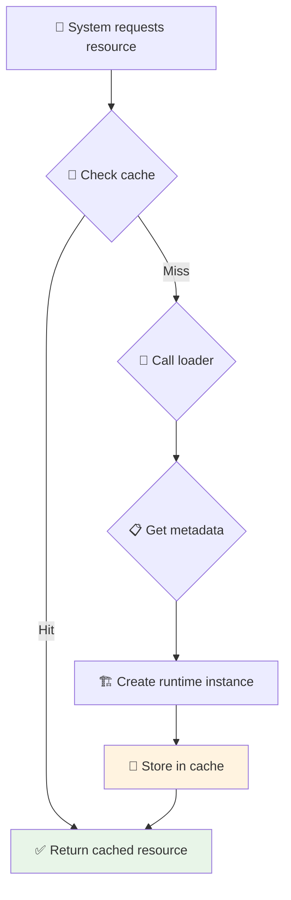

### 🎭 Scene Instantiation

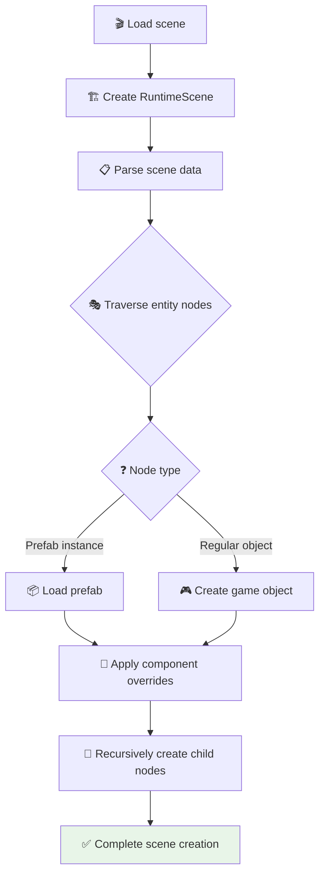

### 🔗 Scripting System Interop

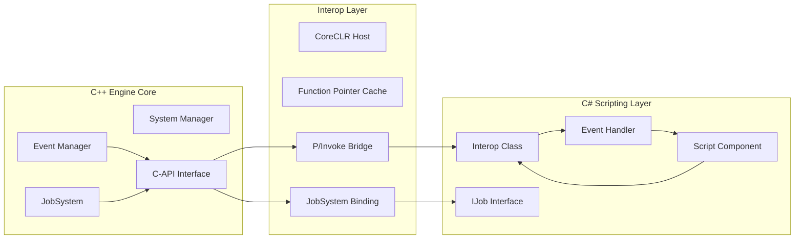

### ✨ Visual Blueprint System

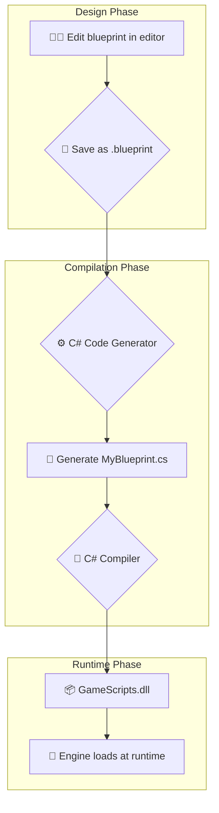

### ⚡ Physics Update Loop

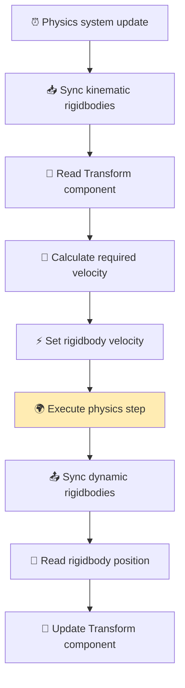

### 🎨 Render Pipeline

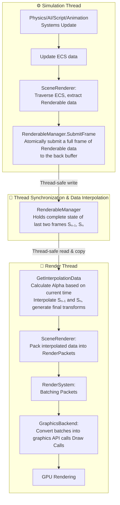

### 🧩 Tilemap System

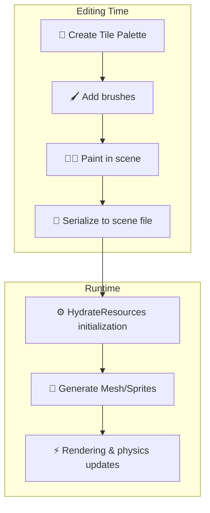

### 🔊 Audio System

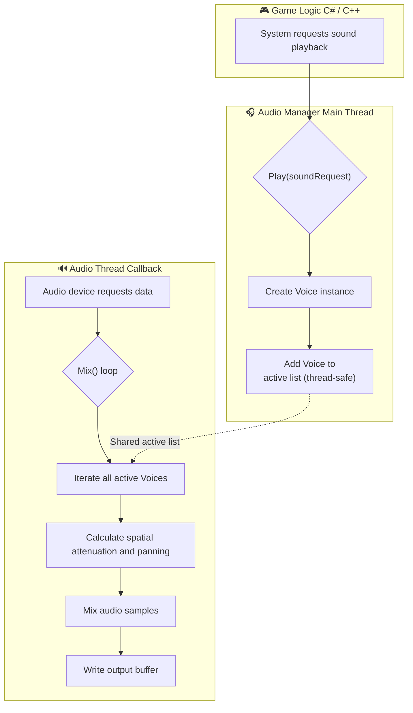

### ⚙️ JobSystem Parallel Processing

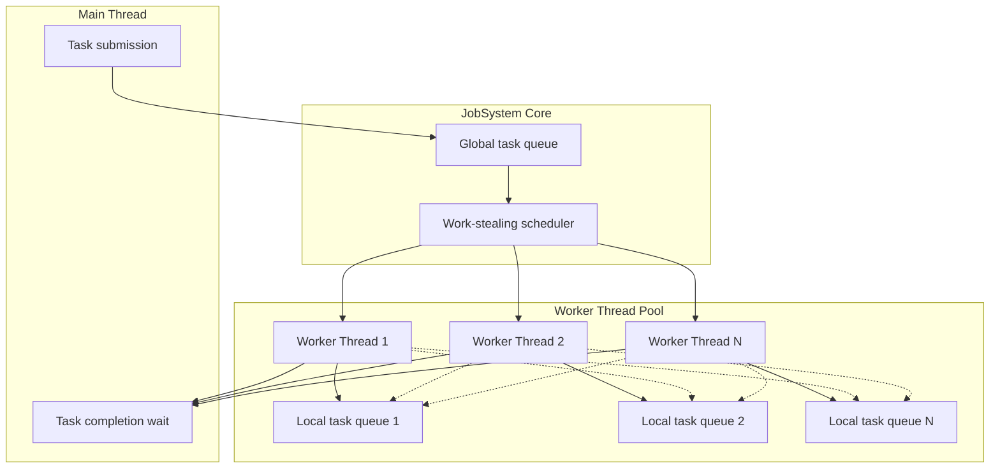

### 🎬 Animation State Machine

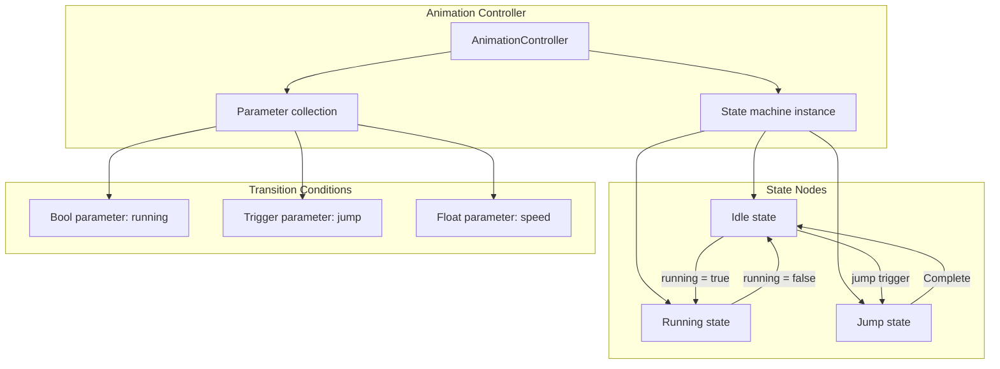

-----

[⬆️ Return to Main Document](README_EN.md)