Luma Engine – Architecture Deep-Dive  
*(English Version)*

This document details the core architecture and data-flow diagrams of every major system in Luma Engine.

[Return to Main Document](README_EN.md)

---

## 🏗️ High-Level Architecture

The diagram below illustrates the modular architecture and data flow of Luma Engine:

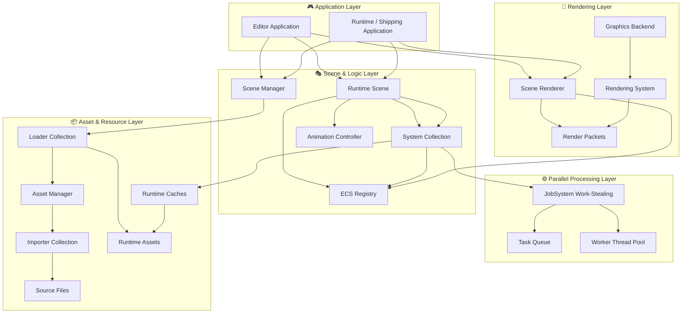

---

## ⚙️ Core-System Data Flows

### 📦 Asset Pipeline Workflow

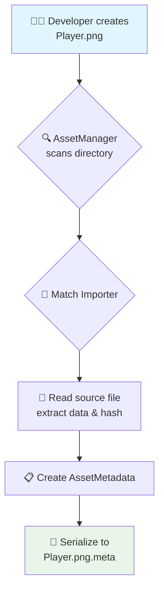

### 💾 Runtime Resource Loading

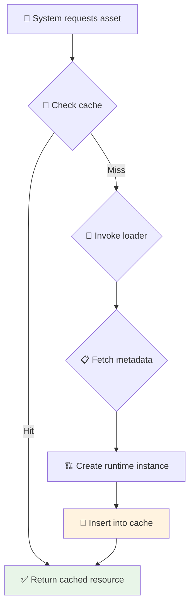

### 🎭 Scene Instantiation

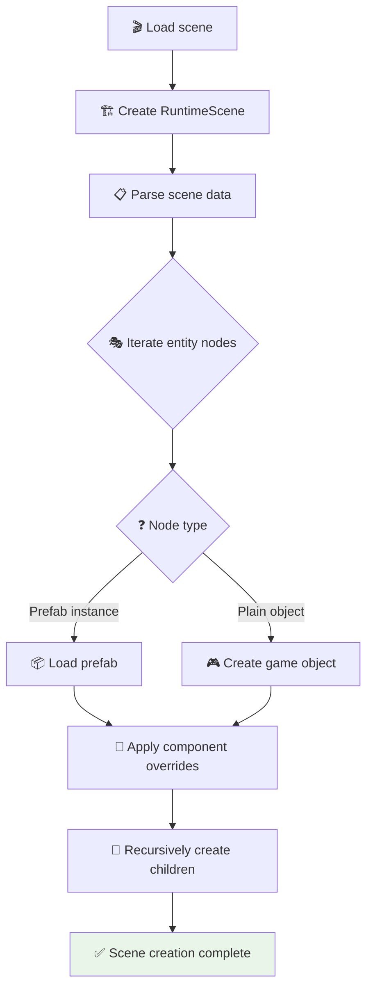

### 🔗 Scripting Interop

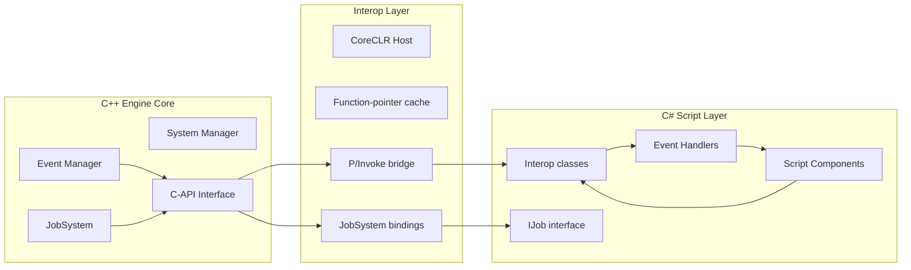

### ✨ Visual Blueprint System

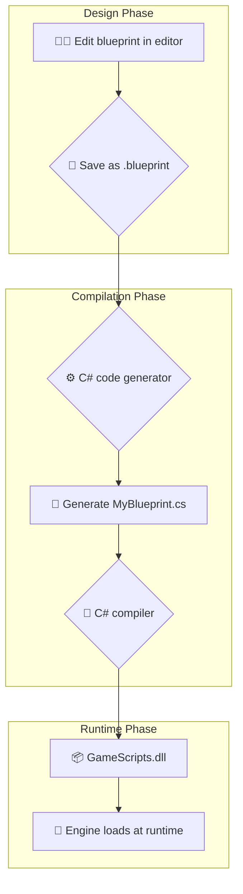

### ⚡ Physics Update Loop

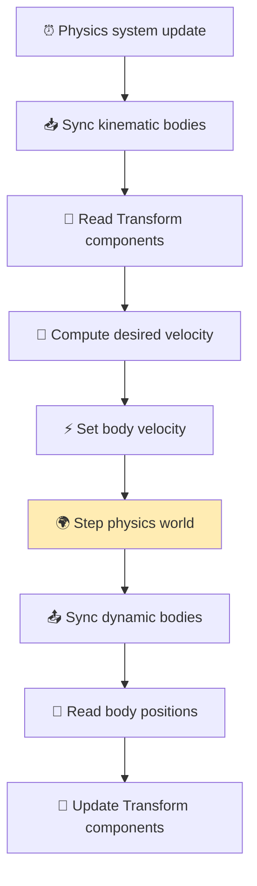

### 🎨 Render Pipeline

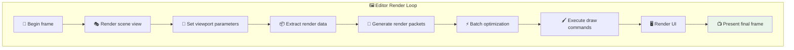

### 🧩 Tilemap System

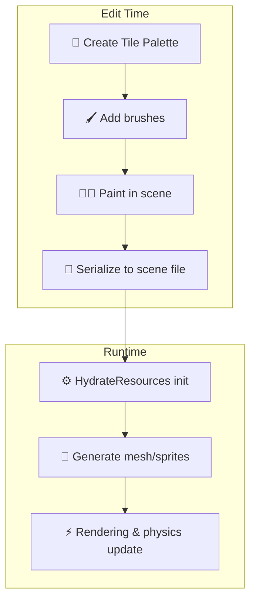

### 🔊 Audio System

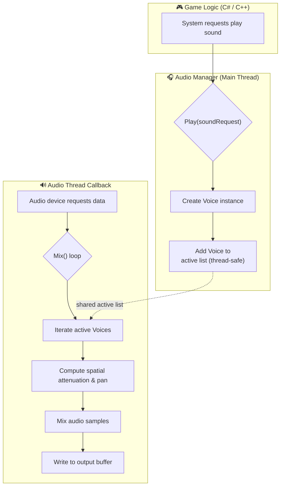

### ⚙️ JobSystem Parallel Processing

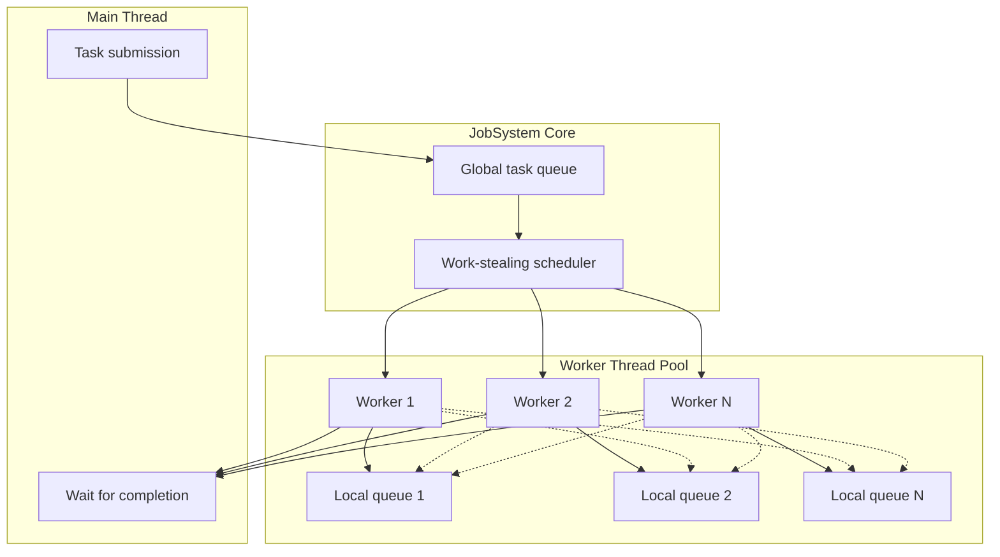

### 🎬 Animation State Machine

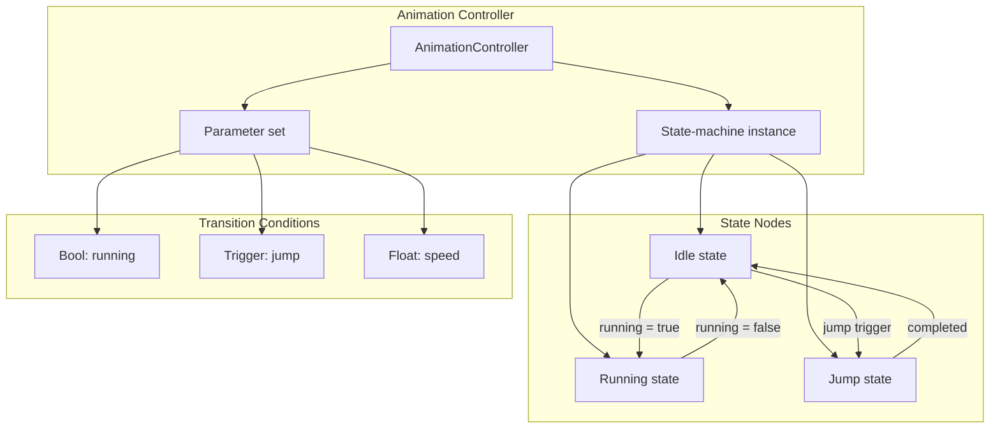

---

[⬆️ Return to Main Document](README_EN.md)