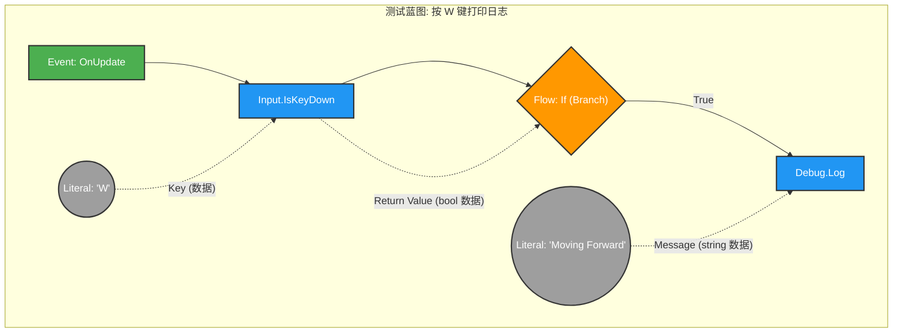
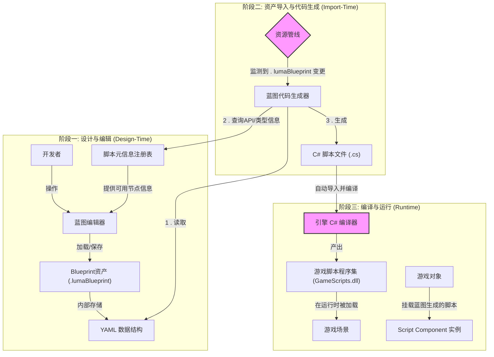

```mermaid
graph TD
    subgraph "测试蓝图: 按 W 键打印日志"
    %% 定义节点样式
        classDef event fill: #4CAF50, color: #fff, stroke: #333, stroke-width: 2px;
        classDef function fill: #2196F3, color: #fff, stroke: #333, stroke-width: 2px;
        classDef flow fill: #FF9800, color: #fff, stroke: #333, stroke-width: 2px;
        classDef data fill: #9E9E9E, color: #fff, stroke: #333, stroke-width: 2px;

    %% 定义节点
        A["Event: OnUpdate"]:::event;
        B["Input.IsKeyDown"]:::function;
        C{"Flow: If (Branch)"}:::flow;
        D["Debug.Log"]:::function;
        E(("Literal: 'W'")):::data;
        F(("Literal: 'Moving Forward'")):::data;

    %% 连接执行流 (Exec Flow)
        A --> B;
        B --> C;
        C -->|True| D;

    %% 连接数据流 (Data Flow)
        E -. " Key (数据) " .-> B;
        B -. " Return Value (bool 数据) " .-> C;
        F -. " Message (string 数据) " .-> D;
    end
```

```mermaid
graph TD
subgraph "阶段一: 设计与编辑 (Design-Time)"
User[开发者] -->|操作|EditorUI[蓝图编辑器];
Meta[脚本元信息注册表] -->|提供可用节点信息|EditorUI;
EditorUI -->|加载/保存| BlueprintAsset["Blueprint资产 (.lumaBlueprint)"];
BlueprintAsset -->|内部存储|YamlData[YAML 数据结构];
end

subgraph "阶段二: 资产导入与代码生成 (Import-Time)"
style AssetPipeline fill: #f9f, stroke: #333, stroke-width: 2px

AssetPipeline{资源管线} -->|监测到 . lumaBlueprint 变更|CodeGen[蓝图代码生成器];
CodeGen -->|1 . 读取| YamlData;
CodeGen -->|2 . 查询API/类型信息| Meta;
CodeGen -->|3 . 生成| CsFile["C# 脚本文件 (.cs)"];
end

subgraph "阶段三: 编译与运行 (Runtime)"
style CSharpCompiler fill: #f9f, stroke: #333, stroke-width:2px

CsFile -->|自动导入并编译|CSharpCompiler[引擎 C# 编译器];
CSharpCompiler -->|产出|Assembly["游戏脚本程序集 (GameScripts.dll)"];
Assembly -->|在运行时被加载|Scene[游戏场景];
GameObject[游戏对象] -->|挂载蓝图生成的脚本|ScriptComponent[Script Component 实例];
end
```