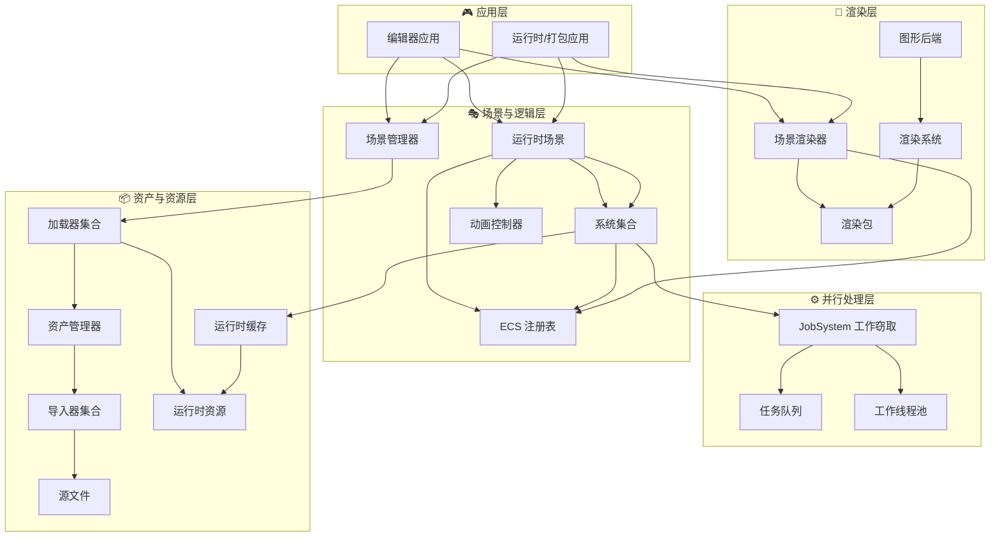
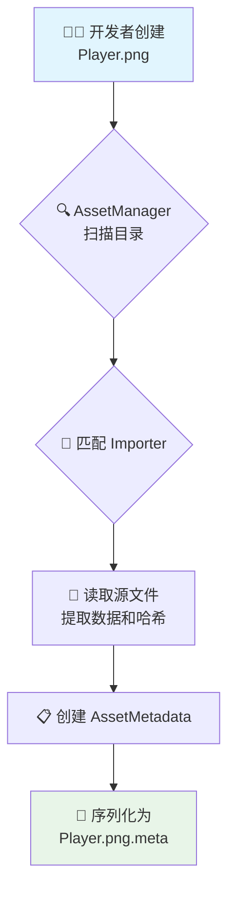
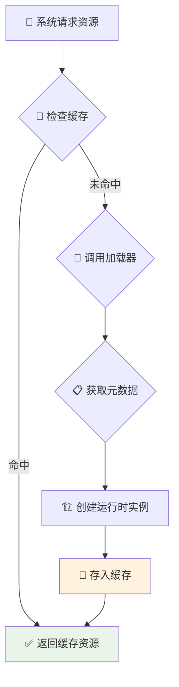
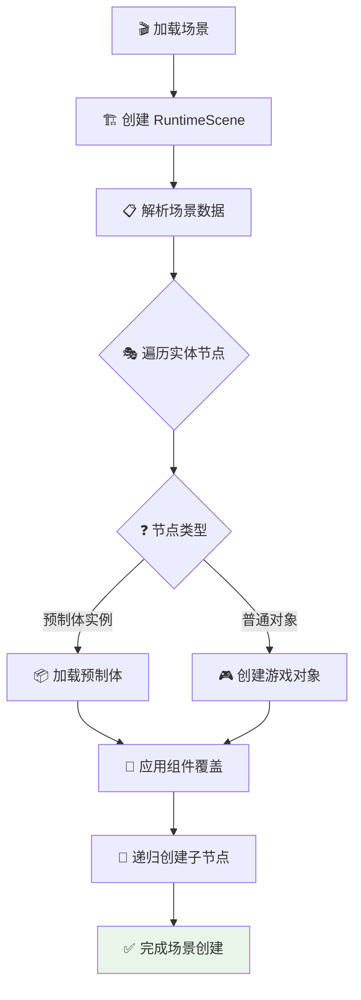
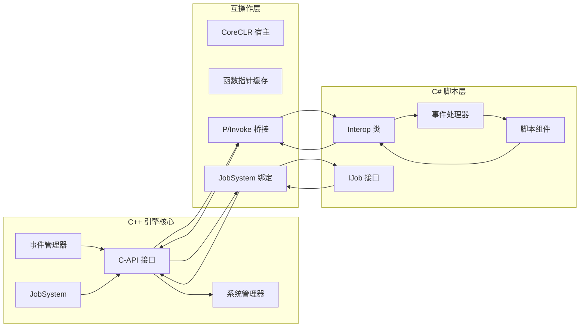
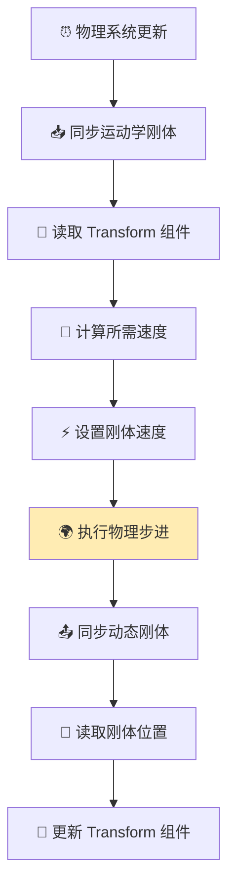
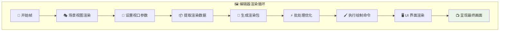
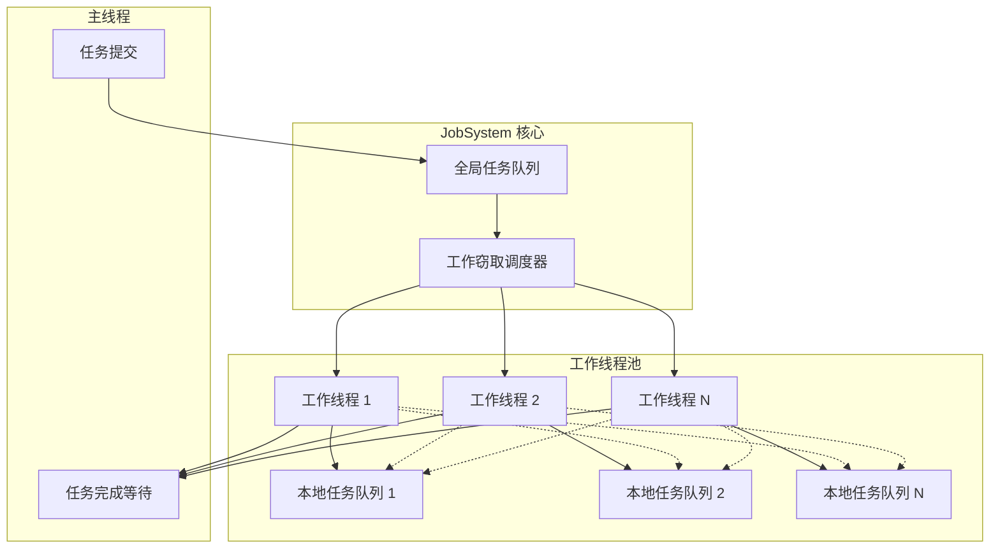
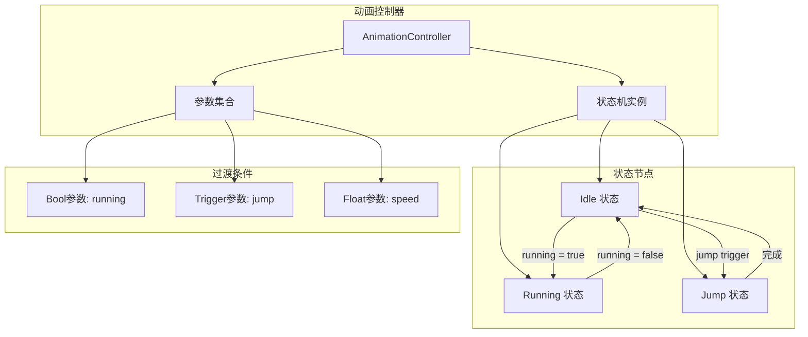

<div align="center">

# 🎮 Luma 引擎

## 现代化 2D 游戏引擎架构设计文档


*基于 C++20 的现代化、模块化、数据驱动的实时 2D 游戏引擎*

</div>

---

## 📚 目录

- [🎯 快速开始](#-快速开始)
- [📖 概述](#-概述)
    - [🎨 核心设计哲学](#-核心设计哲学)
    - [🛠️ 技术栈](#️-技术栈)
- [🏗️ 整体架构](#️-整体架构)
- [⚙️ 核心系统](#️-核心系统)
    - [📦 资产管线工作流](#-资产管线工作流)
    - [💾 运行时资源加载](#-运行时资源加载)
    - [🎭 场景实例化](#-场景实例化)
    - [🔗 脚本系统互操作](#-脚本系统互操作)
    - [⚡ 物理更新循环](#-物理更新循环)
    - [🎨 渲染管线](#-渲染管线)
    - [⚙️ JobSystem 并行处理](#️-jobsystem-并行处理)
    - [🎬 动画状态机](#-动画状态机)
- [📊 项目状态](#-项目状态)
- [🧪 性能分析](#-性能分析)
- [❓ 常见问题](#-常见问题)
- [🤝 贡献指南](#-贡献指南)

---

## 🎯 快速开始
### 🚀 克隆源码

```bash
git clone https://github.com/NGLSG/Luma.git
cd Luma
```

由于第三方库未使用子模块管理，自行克隆下方依赖
astc-encoder
box2d
coreclr
coreclr-linux-x64
coreclr-win-x64
entt
glm
imgui
imgui-node-editor
ImGuizmo
json
llama-cpp
SDL
skia-linux
skia-win
yaml-cpp
对于CoreCLR和Skia需要自行构建
-----

### 🖥️ 系统配置要求

| 组件 | 最低要求 | 推荐配置 | 当前支持情况 |
| :--- | :--- | :--- | :--- |
| **操作系统** | Windows 10 (64位) / Linux (主流发行版) | Windows 11 (22H2+) / Ubuntu 22.04+ | Windows / **Linux** |
| **图形API** | DirectX 11 / Vulkan 1.2 | DirectX 12 Ultimate / Vulkan 1.3 | DX11/DX12/**Vulkan/GL/GLES** |
| **编译器** | MSVC 2019 (v16.11+) / GCC 11+ / Clang 14+ | MSVC 2022 最新版 / 最新版 GCC/Clang | 需安装对应平台SDK |
| **内存** | 8GB RAM | 16GB+ RAM | 建议12GB以上物理内存 |
| **显卡** | NVIDIA GTX 1060 / AMD RX 580 或同等性能 | RTX 3060 / RX 6700 XT 或更高 | 需支持Shader Model 6.0+ / Vulkan 1.2+ |

**跨平台路线说明**：

```diff
+ 当前平台支持：
  - Windows (DirectX 11/12, Vulkan)
+ - Linux (Vulkan, OpenGL, OpenGL ES)
+ 正在进行中：
+ - Android (Vulkan)
- 评估中：
  - macOS (Metal)
```

## 📖 概述

Luma 引擎是一个专为现代 2D 游戏开发设计的高性能引擎。核心目标是打造一个Unity2D的替代品。

### 🎨 核心设计哲学

<table>
<tr>
<td width="50%">

#### 🎯 数据驱动

引擎的行为和内容完全由外部数据定义，支持热重载和实时编辑。

#### 🧩 ECS 架构

基于 EnTT 的高性能实体组件系统，实现了数据与逻辑的完全分离。

</td>
<td width="50%">

#### 🔗 GUID 引用

所有资产通过全局唯一标识符进行引用，确保跨平台的稳定性。

#### ⚡ 并行优化

基于工作窃取算法的 JobSystem，充分利用多核 CPU 性能。

</td>
</tr>
</table>

### 🛠️ 技术栈

#### 核心技术

| 类别       | 技术    | 版本     | 用途   |
|----------|-------|--------|------|
| **编程语言** | C++   | 20     | 引擎核心 |
| **脚本语言** | C#    | .NET 9 | 游戏逻辑 |
| **构建系统** | CMake | 3.20+  | 项目构建 |

#### 核心库

| 库名              | 用途     | 特性         |
|-----------------|--------|------------|
| **EnTT**        | ECS 系统 | 高性能、类型安全   |
| **Box2D**       | 物理模拟   | 2D 物理、碰撞检测 |
| **Skia + Dawn** | 渲染后端   | 跨平台图形渲染    |
| **yaml-cpp**    | 数据序列化  | 人类可读的配置    |
| **SDL3**        | 窗口管理   | 跨平台窗口和输入   |
| **Dear ImGui**  | 调试界面   | 即时模式 GUI   |
| **GLM**         | 数学运算   | 向量和矩阵运算    |

---

## 🏗️ 整体架构

下图展示了 Luma 引擎的模块化架构和数据流：



---

## ⚙️ 核心系统

### 📦 资产管线工作流

> **目标**: 将开发者创建的源文件转换为引擎可用的元数据文件

#### 工作流程图



#### 详细步骤

| 步骤           | 操作                               | 说明            |
|--------------|----------------------------------|---------------|
| **1. 文件创建**  | 开发者在 `Assets/` 目录创建 `Player.png` | 支持多种资产类型      |
| **2. 自动扫描**  | `AssetManager` 检测文件变化            | 实时监控文件系统      |
| **3. 导入器匹配** | 根据扩展名选择 `TextureImporter`        | 可扩展的导入器系统     |
| **4. 数据提取**  | 提取纹理数据、计算哈希值                     | 确保数据完整性       |
| **5. 元数据生成** | 创建 `.meta` 文件                    | 包含 GUID 和导入设置 |

### 💾 运行时资源加载

> **目标**: 根据 GUID 高效加载和缓存运行时资源

#### 工作流程图



#### 缓存策略

| 缓存类型       | 生命周期   | 用途      |
|------------|--------|---------|
| **强引用缓存**  | 手动释放   | 频繁使用的资源 |
| **弱引用缓存**  | 自动回收   | 临时资源    |
| **LRU 缓存** | 最近最少使用 | 内存受限环境  |

### 🎭 场景实例化

> **目标**: 将场景数据转换为可运行的实体组件集合

#### 工作流程图



### 🔗 脚本系统互操作

> **目标**: 实现 C++ 和 C# 之间的无缝通信

#### 架构图



#### C# JobSystem 使用示例

```csharp
/// <summary>
/// 一个用于并行计算数组片段总和的作业。
/// </summary>
private class SumJob : IJob
{
    private readonly long[] data;
    private readonly int startIndex;
    private readonly int endIndex;
    private readonly long[] partialSum;
    private readonly int resultIndex;

    public SumJob(long[] sourceData, int start, int end, long[] results, int index)
    {
        data = sourceData;
        startIndex = start;
        endIndex = end;
        partialSum = results;
        resultIndex = index;
    }

    /// <summary>
    /// 执行求和任务。
    /// </summary>
    public void Execute()
    {
        long sum = 0;
        for (int i = startIndex; i < endIndex; i++)
        {
            sum += data[i];
        }
        partialSum[resultIndex] = sum;
    }
}

// 使用 JobSystem 调度任务
var jobHandles = new List<JobHandle>();
for (int i = 0; i < jobCount; i++)
{
    var job = new SumJob(data, startIndex, endIndex, results, i);
    jobHandles.Add(JobSystem.Schedule(job));
}
JobSystem.CompleteAll(jobHandles);
```

### ⚡ 物理更新循环

> **目标**: 保持物理模拟与图形渲染的同步

#### 更新流程



### 🎨 渲染管线

> **目标**: 高效地将场景内容渲染到屏幕

#### 渲染流程



### ⚙️ JobSystem 并行处理

> **目标**: 基于工作窃取算法的高性能并行计算系统

#### 系统架构



#### 性能基准测试结果

基于真实硬件测试（20核心处理器）的性能数据：

| 测试场景         | 单线程耗时   | 简单多线程耗时       | JobSystem耗时   | 性能提升比  |
|--------------|---------|---------------|---------------|--------|
| **均衡负载计算**   | 3.59 ms | 1.63 ms       | 1.18 ms       | 3.0×   |
| **不均衡负载计算**  | N/A     | 2.38 ms       | 1.30 ms       | 1.8×   |
| **复杂矩阵运算**   | N/A     | 127.06 ms     | 111.17 ms     | 1.1×   |
| **高并发吞吐量测试** | N/A     | 33,101 jobs/s | 33,178 jobs/s | 1.002× |

#### 关键特性

- **工作窃取算法**: 动态负载均衡，避免线程空闲
- **无锁设计**: 高性能的并发安全实现
- **细粒度任务**: 支持 256-2048 个任务的灵活调度
- **C# 绑定**: 完整的脚本层并行计算支持

### 🎬 动画状态机

> **目标**: 基于状态机的高效 2D 动画播放系统

#### 状态机架构



#### 使用示例

```csharp
public class PlayerController : Script
{
    private AnimationController controller;
    
    public override void OnCreate()
    {
        controller = AnimationSystem.GetController(Self);
    }
    
    public override void OnUpdate(float deltaTime)
    {
        bool isRunning = Input.IsKeyPressed(Scancode.A) || 
                        Input.IsKeyPressed(Scancode.D);
        
        // 设置动画参数
        controller?.SetBool("running", isRunning);
        
        if (Input.IsKeyJustPressed(Scancode.Space))
        {
            controller?.SetTrigger("jump");
        }
    }
}
```

---

## 📊 项目状态

### ✅ 已完成功能

<table>
<tr>
<td width="50%">

#### 🏗️ 核心系统

- ✅ 完整的 GUID 驱动资产管线
- ✅ 多格式资产支持（纹理、材质、预制体、场景、脚本）
- ✅ 高性能运行时资源缓存
- ✅ 基于 EnTT 的 ECS 架构
- ✅ **工作窃取 JobSystem**
- ✅ **动画状态机系统**

</td>
<td width="50%">

#### 🎮 游戏功能

- ✅ C# 脚本宿主环境
- ✅ C++/C# 双向通信
- ✅ **C# JobSystem 绑定**
- ✅ Box2D 物理集成
- ✅ 基于物理的交互系统
- ✅ **2D 动画播放与控制**

</td>
</tr>
<tr>
<td colspan="2">

#### 🎨 渲染与工具链

- ✅ 自动批处理的 2D 渲染管线
- ✅ 离屏渲染支持
- ✅ **完整编辑器工具**
- ✅ Scene View 和 Game View
- ✅ **生产级游戏打包功能**
- ✅ 实现 Profiler 分析器
- ✅ 实现 可视化物理编辑
- ✅ 实现 动态扩展的Inspector 窗口,支持C#属性反射

</td>
</tr>
</table>

### 🚀 开发路线图

| 优先级   | 功能         | 状态     | 预计完成    |
|-------|------------|--------|---------|
| **中** | C-API 功能扩展 | 📋 计划中 | Q3 2025 |
| **低** | 让界面更现代化    | 💭 研究中 | Q4 2025 |
| **低** | 粒子系统       | 📋 计划中 | Q4 2025 |

### 📈 性能指标

#### 场景渲染性能

- 设备：同一台测试设备（冷却后状态）
- 对比引擎：Unity 6000.1.13f1
- 数据说明：所有数据均为实测均值，无插值/外推
- 测试场景：在同一场景下，使用相同的实体数量和组件配置进行测试

| 场景                 | 关键指标   | 本引擎            | Unity                       | 性能倍数      |
|--------------------|--------|----------------|-----------------------------|-----------|
| **10,000 实体 + 碰撞** | 总帧时间   | **2.40 ms**    | 45.45 ms                    | **18.9×** |
|                    | 理论 FPS | **416 FPS**    | 22 FPS                      | 同上        |
|                    | 物理更新耗时 | **0.92 ms**    | 未测试                         | —         |
|                    | 内存占用   | **114.375 MB** | 未测试                         | —         |
| **100,000 实体纯渲染**  | FPS    | **85 FPS**     | 8–9 FPS                     | **9.4×**  |
| **200,000 纯渲染**    | FPS    | **60 FPS**     | 60 FPS（实例化 + JobSystem）     | **1.0×**  |
| **1,000,000 纯渲染**  | FPS    | 13 FPS         | **20 FPS**（实例化 + JobSystem） | **0.65×** |

#### JobSystem 并行性能

基于 20 核心处理器的测试结果：

| 测试场景        | 单线程基准   | JobSystem     | 性能提升     |
|-------------|---------|---------------|----------|
| **均衡计算负载**  | 3.59 ms | 1.18 ms       | **3.0×** |
| **不均衡负载**   | N/A     | vs 静态分区 1.8×  | 动态调度优势   |
| **高并发吞吐量**  | N/A     | 33,178 jobs/s | 优于线程池    |
| **内存密集型计算** | N/A     | 8.08 GB/s     | 高内存带宽    |

---

### 🧮 性能分析

1. **内存效率**：

- 每个实体约占用11.7KB (117120KB/10000)

2. **耗时分布**：
   ```mermaid
   pie
       title 帧时间占比
       "绘制" : 62
       "物理" : 38
   ```

3. **JobSystem 线程利用率**：
   ```mermaid
   pie
    title 任务分配均衡性
    "线程 4,5 (各29任务)" : 22.7
    "线程 3,7,8 (各27-28)" : 21.1
    "线程 1,2,8 (各23)" : 18.0
    "线程 0,6 (各18)" : 14.1
    "线程 9,10,11 (各9-16)" : 24.1
   ```

---

### 📜 API 文档生成

为了维护项目代码的清晰度和可维护性，Luma 引擎使用 [Doxygen](https://www.doxygen.nl/) 自动生成 API
文档。

#### 环境准备

1. **安装 Doxygen**: 从官方网站下载并安装最新版本的 Doxygen。
2. **安装 Graphviz** (可选): 为了生成类图、协作图等可视化图表，需要安装 [Graphviz](https://graphviz.org/download/)，并将其
   `bin` 目录添加到系统环境变量 `PATH` 中。

#### 生成步骤

1. 将下方提供的 `Doxyfile` 配置文件放置在项目根目录。

2. 在项目根目录打开终端，执行以下命令：

   ```sh
   doxygen Doxyfile
   ```

3. 命令执行完毕后，会在项目根目录生成一个 `docs/` 文件夹。打开 `docs/html/index.html` 即可浏览完整的 API 文档

---

### ❓ 常见问题

<details>
<summary><strong>如何添加自定义组件？</strong></summary>

1. 创建组件结构体：

```cpp
struct CustomComponent:IComponent {
    float value;
    std::string name;
};
```

2. 注册组件：

```cpp
Registery_<CustomComponent>("CustomComponent")
    .property("name",&CustomComponent::name)
    .property("value", &CustomComponent::value);
```

3. 在脚本中使用：

```csharp
var component = Self.GetComponent<CustomComponent>();
```

</details>

<details>
<summary><strong>如何优化渲染性能？</strong></summary>

- 使用精灵图集减少纹理切换
- 启用自动批处理
- 合理使用层级排序
- 避免频繁的 Transform 修改

</details>

<details>
<summary><strong>如何使用 JobSystem 进行并行计算？</strong></summary>

```csharp
// 1. 实现 IJob 接口
public class MyJob : IJob
{
    public void Execute()
    {
        // 您的计算逻辑
    }
}

// 2. 调度任务
var job = new MyJob();
var handle = JobSystem.Schedule(job);

// 3. 等待完成
JobSystem.Complete(handle);
```

</details>

<details>
<summary><strong>脚本热重载如何工作？</strong></summary>

引擎监控 C# 脚本文件变化，自动重新编译并重新加载程序集，保持游戏状态不变。
</details>

<details>
<summary><strong>如何创建动画状态机？</strong></summary>

1. 在编辑器中创建 AnimationController 资产
2. 添加状态和过渡条件
3. 在脚本中获取控制器：

```csharp
var controller = AnimationSystem.GetController(Self);
controller.SetBool("running", true);
```

</details>

---

### 🤝 贡献指南

### 代码规范

#### 命名约定

- **类名**: `PascalCase` (例: `AssetManager`)
- **函数名**: `PascalCase` (例: `LoadAsset`)
- **变量名**: `camelCase` (例: `deltaTime`)
- **私有成员**: `camelCase` (例: `textureCache`)
- **常量**: `UPPER_SNAKE_CASE` (例: `MAX_TEXTURES`)

#### 注释规范

项目采用 Doxygen 风格的注释来确保代码的可读性并自动生成 API 文档。所有公开的类、方法和成员都必须添加符合规范的注释。

**函数/方法注释示例:**

```cpp
/**
 * @brief 加载指定 GUID 的纹理资源。
 * @details 此函数会首先检查内部缓存。如果缓存未命中，则会从磁盘加载资源文件，
 * 解码为 Skia 图像对象，并将其存入缓存以备后续使用。
 * @param guid 纹理资源的全局唯一标识符 (GUID)。
 * @return sk_sp<SkImage> 加载成功返回指向 SkImage 对象的智能指针，失败则返回 nullptr。
 * @note 此操作可能会涉及 I/O，属于耗时操作，不应在性能敏感的主循环中频繁调用。
 */
sk_sp<SkImage> LoadTexture(const Guid& guid);
```

**类/结构体注释示例:**

```cpp
/**
 * @brief 资产管理器，负责项目中所有资产的导入、加载和生命周期管理。
 * @details 这是一个单例 (Singleton) 类，提供了通过 GUID 或路径访问资产元数据的接口。
 * 它还负责监控文件系统变更并自动触发资产导入流程。
 * @see AssetMetadata, IAssetImporter
 */
class AssetManager : public LazySingleton<AssetManager>
{
public:
    // 公开接口...

private:
    /// @brief 运行时纹理资源的缓存。键为 GUID 字符串，值为 Skia 图像对象。
    std::unordered_map<std::string, sk_sp<SkImage>> textureCache;
};
```

**关键指令说明:**

| 指令        | 用途                           |
| :---------- | :----------------------------- |
| `@brief`    | 提供一个简短的单行摘要。         |
| `@details`  | 提供更详尽的描述信息。           |
| `@param`    | 描述函数的参数。               |
| `@return`   | 描述函数的返回值。             |
| `@note`     | 添加需要特别注意的事项。         |
| `@see`      | 引用其他相关的类或函数。         |
| `///`       | 用于成员变量或简单注释的单行格式。 |

### 提交流程

1. **Fork** 仓库并创建功能分支
2. 按照代码规范编写代码
3. 添加必要的测试用例
4. 更新相关文档
5. 提交 **Pull Request**

---

<div align="center">

## 📄 许可证

本项目采用 [许可证](LICENSE) 开源。

---

**Luma 引擎** - 为现代 2D 游戏开发而生 🎮

[⬆️ 返回顶部](#-luma-引擎)

</div>