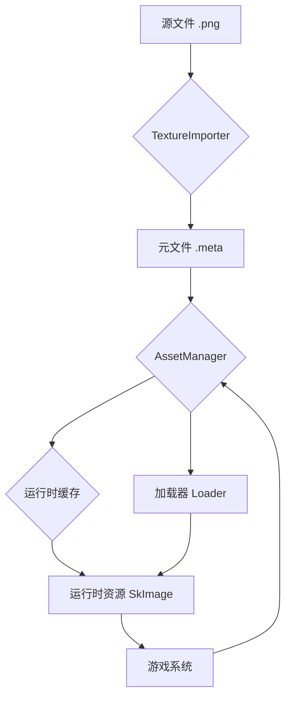

<div align="center">

# 🎮 Luma 引擎

[引擎架构](ARCHITECTURE.md)
[English Version](README_EN.md)

**一款基于 C++20 和 C# 的现代化、模块化、数据驱动的高性能实时 2D 游戏引擎，旨在成为 Unity 2D 的强大替代品。**

</div>

-----

## 目录

- [✨ 核心特性 & 性能亮点](#-核心特性--性能亮点)
  - [🚀 性能对比：Luma vs. Unity DOTS](#-性能对比luma-vs-unity-dots)
  - [🌟 关键功能一览](#-关键功能一览)
- [📖 概述与设计哲学](#-概述与设计哲学)
  - [🛠️ 技术栈](#️-技术栈)
- [🎯 快速开始](#-快速开始)
  - [环境与依赖 (Environment & Dependencies)](#环境与依赖-environment--dependencies)
  - [🔧 构建 Luma 引擎 (Building Luma Engine)](#-构建-luma-引擎-building-luma-engine)
- [⚙️ 核心系统深度解析](#️-核心系统深度解析)
- [📊 项目状态与路线图](#-项目状态与路线图)
  - [✅ 已完成功能](#-已完成功能)
  - [🚀 开发路线图](#-开发路线图)
- [🤝 贡献指南](#-贡献指南)
  - [代码规范](#代码规范)
  - [提交流程](#提交流程)
- [📄 许可证](#-许可证)

-----

## ✨ 核心特性 & 性能亮点

Luma 引擎专为极致性能和现代化开发体验而设计。我们相信，卓越的性能是释放创造力的基石。

### 🚀 性能对比：Luma vs. Unity DOTS

Unity版本:6.1 lts
在相同硬件上，Luma 在大规模动态精灵渲染和物理模拟场景中均表现出显著的性能优势。

#### 场景渲染性能 (动态精灵)

*在视野内动态生成、移动、旋转和缩放大量精灵。*

| 实体数量          | Luma 引擎 (FPS) | Unity DOTS (FPS) | **性能倍数**  |
|:--------------|:-------------:|:----------------:|:---------:|
| **100,000**   |   ~100 FPS    |     ~30 FPS      | **~3.3×** |
| **200,000**   |    ~50 FPS    |     ~15 FPS      | **~3.3×** |
| **1,000,000** |    ~10 FPS    |      ~2 FPS      | **~5.0×** |

#### 物理模拟性能

*10,000 个动态物理刚体 (Box2D) 实时碰撞模拟。*

| 指标         |     本引擎      |  Unity   | **性能倍数**  |
|:-----------|:------------:|:--------:|:---------:|
| **总帧时间**   | **2.40 ms**  | 45.45 ms | **18.9×** |
| **理论 FPS** | **~416 FPS** | ~22 FPS  | **18.9×** |

### 🌟 关键功能一览

<table>
<tr>
<td width="50%">

#### 🧩 **现代 ECS 架构**

- 基于业界领先的 **EnTT** 库，实现极致性能的数据访问。
- 逻辑与数据完全分离，代码结构清晰，易于扩展和维护。

#### ⚡ **高性能并行计算**

- 内置基于**工作窃取**算法的 `JobSystem`，动态负载均衡，榨干多核CPU性能。
- 提供完整的 **C# JobSystem 绑定**，让游戏逻辑也能享受并行带来的快感。

</td>
<td width="50%">

#### ✨ **可视化蓝图系统**

- 强大的节点式编辑器，无需编码即可创建复杂逻辑。
- **直接生成高性能 C# 代码**，而非运行时解释，性能无损。
- 可调用任意 C# 函数，支持自定义函数和变量。

#### 🔗 **无缝 C++/C# 互操作**

- 基于 .NET 9 CoreCLR 宿主，实现稳定、高效的双向通信。
- **脚本热重载**：修改 C# 代码后无需重启引擎即可立即看到效果。

</td>
</tr>
</table>

-----

## 📖 概述与设计哲学

Luma 引擎的核心目标是为 2D 游戏开发者提供一个兼具极致性能与现代化工作流的开发平台。我们遵循以下设计原则：

- **数据驱动**: 引擎的一切（场景、实体、组件、动画）皆为数据。这使得热重载、编辑器扩展和程序化内容生成变得极其简单。
- **模块化与可扩展性**: 引擎的每个核心系统（渲染、物理、音频等）都是高度解耦的模块，方便独立升级、替换或扩展。
- **性能优先**: 从 ECS 架构的选择到 JobSystem 的设计，每一个决策都将性能放在首位。

### 🛠️ 技术栈

| 类别         | 技术            | 版本/库             |
|:-----------|:--------------|:-----------------|
| **核心语言**   | C++           | C++20 标准         |
| **脚本语言**   | C#            | .NET 9 (CoreCLR) |
| **构建系统**   | CMake         | 3.21+            |
| **ECS 框架** | EnTT          | latest           |
| **2D 物理**  | Box2D         | latest           |
| **渲染后端**   | Skia + Dawn   | 跨平台图形 API 封装     |
| **窗口与输入**  | SDL3          | 跨平台窗口管理          |
| **编辑器 UI** | Dear ImGui    | 即时模式 GUI 工具包     |
| **数据序列化**  | yaml-cpp/json | YAML/json 格式读写   |

-----

## 🎯 快速开始

首先，克隆本仓库到你的本地计算机：

```bash
git clone https://github.com/NGLSG/Luma.git
cd Luma
```

### 环境与依赖 (Environment & Dependencies)

在开始构建之前，请确保你的系统环境和所有依赖项都已正确配置。

#### 1. 前置要求 (Prerequisites)

请确保你已安装以下系统级的库和工具：

* **Git**
* **CMake** (版本 **3.21** 或更高)
* **Vulkan SDK**
* **C++ 编译器** (例如: Visual Studio 2022 / GCC 11 / Clang 14)

#### 2. 依赖管理 (Dependency Management)

Luma 使用 **CPM.cmake** 和 **Vcpkg** 的组合来管理第三方依赖。这简化了获取和构建依赖的过程。

**选项 A: 使用 Vcpkg (推荐)**

1.  **安装 Vcpkg**: 如果你还没有安装 Vcpkg，请按照 [官方指南](https://vcpkg.io/en/getting-started.html) 进行安装。
2.  **配置 CMake**: 在配置 CMake 时，请确保指向你的 Vcpkg 工具链文件。

    ```bash
    # 在项目根目录下
    mkdir build
    cd build
    # 请将 <path_to_vcpkg> 替换为你的 Vcpkg 安装路径
    cmake .. -DCMAKE_TOOLCHAIN_FILE=<path_to_vcpkg>/scripts/buildsystems/vcpkg.cmake
    ```

    Vcpkg 会自动读取项目根目录下的 `vcpkg.json` 清单文件，并下载、编译和安装所有列出的依赖。

**选项 B: 使用系统包管理器 (Linux/macOS)**

对于一些常见的库（如 CURL、OpenSSL），你也可以使用系统的包管理器（如 `apt`、`brew`）来安装。请确保安装了开发包（通常以 `-dev` 或 `-devel` 结尾）。

例如，在 Ubuntu 上：

```bash
sudo apt install libssl-dev libcurl4-openssl-dev
```

CMake 会优先使用通过 `find_package` 找到的系统包。

**选项 C: 使用 CPM.cmake**

对于未通过 Vcpkg 或系统包管理器提供的依赖，项目使用 CPM.cmake 直接从源代码仓库下载和构建。这已内置在项目的 CMake 列表中，无需额外操作。

#### 3. 特殊依赖：Skia 和 CoreCLR

`Skia` (图形库) 和 `CoreCLR` (.NET 运行时) 需要**手动下载**预编译的二进制包。

1.  前往 [Luma-External Releases](https://github.com/NGLSG/Luma-External/releases/tag/Prebuilt) 页面。
2.  根据你的操作系统，下载对应的 `.zip` 包。
  *   **CoreCLR**: `coreclr-win-x64.zip` (Windows) 或 `coreclr-linux-x64.zip` (Linux)
  *   **Skia**: `skia-win.zip` (Windows) 或 `skia-linux.zip` (Linux)
3.  在项目根目录下创建 `External` 文件夹（如果不存在）。
4.  将下载的 `.zip` 文件**解压**到 `External` 目录中。解压后应得到类似 `skia-win/` 和 `coreclr-win-x64/` 的文件夹。

完成以上步骤后，你的 `External` 目录结构应类似于：

```
Luma/
├── External/
│   ├── CMakeLists.txt
│   ├── coreclr-win-x64/    # 解压后的 CoreCLR
│   └── skia-win/           # 解压后的 Skia
└── ...
```

### 🔧 构建 Luma 引擎 (Building Luma Engine)

所有依赖准备就绪后，你可以使用 CMake 来构建项目。

1.  **配置项目** (使用 Vcpkg 示例):

    ```bash
    # 在项目根目录下
    mkdir build
    cd build
    # 请将 E:\vcpkg 替换为你的 Vcpkg 实际安装路径
    cmake .. -DCMAKE_TOOLCHAIN_FILE=E:\vcpkg\scripts\buildsystems\vcpkg.cmake
    ```

2.  **编译项目**:

    ```bash
    cmake --build . --config Release
    # 或者在生成的 Visual Studio 解决方案中编译
    ```

编译成功后，可执行文件将位于 `build` 目录下的相应子目录中（例如 `build/bin/Release/`）。

-----

## ⚙️ 核心系统深度解析

<details>
<summary><strong>📦 资产与资源系统</strong></summary>

Luma 采用基于 **GUID** 的现代化资产管线。所有 `Assets/` 目录下的源文件都会被自动处理，生成一个包含唯一ID和导入设置的
`.meta` 文件。运行时，`AssetManager` 根据 GUID 高效地从磁盘加载或从缓存中获取资源，实现了资源引用的稳定与高效。



</details>

<details>
<summary><strong>✨ 可视化蓝图系统</strong></summary>

它不仅提供了直观的节点编辑体验，更通过**直接生成 C# 源码**的方式，彻底消除了传统可视化脚本的性能瓶颈。

- **工作流程**: `蓝图可视化编辑` -> `保存为.blueprint文件` -> `C#代码生成器` -> `生成.cs脚本` -> `参与项目编译` ->
  `原生性能运行`
- **功能**: 支持事件、分支、循环、自定义函数/变量、调用任意外部 C# 函数、逻辑区域注释框等全部功能。

</details>

<details>
<summary><strong>⚡ 物理与 JobSystem</strong></summary>

物理模拟基于 **Box2D**，运行在**固定时间步长**的独立循环中，确保了结果的确定性。为了处理大量物理对象的交互，物理世界的步进计算被封装成一个
Job，并由 **JobSystem** 分发到多个核心上并行处理，极大提升了性能。

JobSystem 本身基于**工作窃取**算法，能高效处理各种均衡及不均衡的并行计算任务，并已提供完整的 **C# API**。

</details>

<details>
<summary><strong>🎬 动画、Tilemap、UI 和音频</strong></summary>

- **动画状态机**: 提供了强大的可视化编辑器来创建和管理 2D 动画状态（Idle, Run, Jump等）及其过渡条件，并通过 C# API 轻松控制。
- **Tilemap 系统**: 类似于 Unity 的 Tile Palette，支持标准、规则瓦片，甚至允许将**预制体 (Prefab)** 作为笔刷来绘制包含复杂逻辑的游戏对象。
- **UI 系统**: 基于 ECS 构建，提供了 `Text`, `Image`, `Button`, `InputText` 等核心组件，并预留了 `ScrollView` 的支持。
- **音频系统**: 基于 **SDL3**，提供了一个支持 3D 空间音效和动态多声道混音的高性能音频管理器。

</details>

-----

## 📊 项目状态与路线图

### ✅ 已完成功能

- **核心**: 资产管线, ECS, JobSystem, 动画状态机, **可视化蓝图**, Tilemap, UI, **空间音频**
- **功能**: C# 脚本宿主 (热重载), C++/C# 互操作, 物理集成
- **工具**: 功能完善的编辑器, 打包功能, Profiler, 可视化物理调试

### 🚀 开发路线图

| 优先级   | 功能         | 状态     | 预计完成    |
|:------|:-----------|:-------|:--------|
| **中** | C-API 功能扩展 | 📋 计划中 | Q3 2025 |
| **低** | 现代化界面升级    | 💭 研究中 | Q4 2025 |
| **低** | 粒子系统       | 📋 计划中 | Q4 2025 |

-----

## 🤝 贡献指南

我们欢迎所有对游戏引擎开发充满热情的开发者加入 Luma 项目！

### 代码规范

- **命名**: `PascalCase` 用于类型和函数, `camelCase` 用于变量。
- **注释**: 项目采用 **Doxygen** 风格，所有公开 API 都需要有完整的注释。

### 提交流程

1.  **Fork** 本仓库并从 `master` 分支创建您的功能分支。
2.  编写代码并确保遵循项目规范。
3.  提交 **Pull Request** 并详细描述您的改动。

-----

<div align="center">

## 📄 许可证

本项目采用 [MIT 许可证](LICENSE) 开源。

</div>