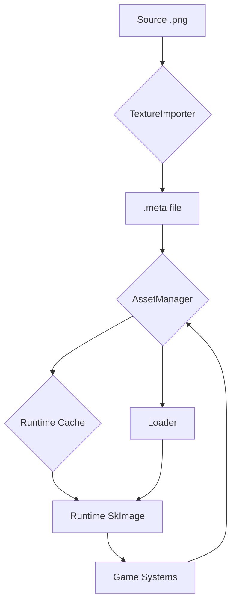

<div align="center">

# 🎮 Luma Engine

[Engine Architecture](ARCHITECTURE_EN.md)
[中文版本](README.md)

**A modern, modular, data-driven, high-performance 2D game engine built with C++20 and C#, created to be a powerful
Unity 2D alternative.**

</div>

---

## Table of Contents

- [✨ Core Features & Performance Highlights](#-core-features--performance-highlights)
    - [🚀 Performance Comparison: Luma vs. Unity DOTS](#-performance-comparison-luma-vs-unity-dots)
    - [🌟 Key Functionality Overview](#-key-functionality-overview)
- [📖 Overview & Design Philosophy](#-overview--design-philosophy)
    - [🛠️ Technology Stack](#️-technology-stack)
- [🎯 Quick Start](#-quick-start)
    - [Environment & Dependencies](#environment--dependencies)
    - [🔧 Building the Luma Engine](#-building-the-luma-engine)
- [⚙️ Deep-Dive: Core Systems](#️-deep-dive-core-systems)
- [📊 Project Status & Roadmap](#-project-status--roadmap)
    - [✅ Completed Features](#-completed-features)
    - [🚀 Development Roadmap](#-development-roadmap)
- [🤝 Contributing](#-contributing)
    - [Code Style](#code-style)
    - [Submission Workflow](#submission-workflow)
- [📄 License](#-license)

---

## ✨ Core Features & Performance Highlights

Luma Engine is designed for ultimate performance and a modern developer experience. We believe outstanding performance
is the cornerstone of unleashed creativity.

### 🚀 Performance Comparison: Luma vs. Unity DOTS

Unity version: 6.1 LTS  
On identical hardware, Luma demonstrates significant performance advantages in large-scale dynamic sprite rendering and
physics simulation scenarios.

#### Scene Rendering Performance (Dynamic Sprites)

*Generate, move, rotate, and scale massive numbers of sprites in view.*

| Entity Count  | Luma Engine (FPS) | Unity DOTS (FPS) | **Performance Multiplier** |
|:--------------|:-----------------:|:----------------:|:--------------------------:|
| **100,000**   |     ~100 FPS      |     ~30 FPS      |         **~3.3×**          |
| **200,000**   |      ~50 FPS      |     ~15 FPS      |         **~3.3×**          |
| **1,000,000** |      ~10 FPS      |      ~2 FPS      |         **~5.0×**          |

#### Physics Simulation Performance

*Real-time collision simulation of 10,000 dynamic rigid bodies (Box2D).*

| Metric              |     Luma     |  Unity   | **Performance Multiplier** |
|:--------------------|:------------:|:--------:|:--------------------------:|
| **Frame Time**      | **2.40 ms**  | 45.45 ms |         **18.9×**          |
| **Theoretical FPS** | **~416 FPS** | ~22 FPS  |         **18.9×**          |

### 🌟 Key Functionality Overview

<table>
<tr>
<td width="50%">

#### 🧩 **Modern ECS Architecture**

- Built on the industry-leading **EnTT** library for ultra-fast data access.
- Full separation of logic and data keeps code clean, extensible, and maintainable.

#### ⚡ **High-Performance Parallel Computing**

- Built-in `JobSystem` based on a **work-stealing** scheduler for dynamic load balancing that fully utilizes multi-core
  CPUs.
- Complete **C# JobSystem bindings** so game logic can harness the same parallel power.

</td>
<td width="50%">

#### ✨ **Visual Blueprint System**

- Powerful node-based editor—create complex logic without writing code.
- **Directly generates high-performance C# source** instead of runtime interpretation—zero overhead.
- Call any C# function, support custom functions and variables.

#### 🔗 **Seamless C++/C# Interop**

- Hosted on .NET 9 CoreCLR for stable, high-efficiency two-way communication.
- **Hot-reload scripting**: modify C# code and see results instantly without restarting the engine.

</td>
</tr>
</table>

---

## 📖 Overview & Design Philosophy

The core mission of Luma Engine is to provide 2D game developers with a platform that combines ultimate performance with
a modern workflow. We follow these design principles:

- **Data-Driven**: Everything in the engine—scenes, entities, components, animations—is data. This makes hot-reloading,
  editor extensibility, and procedural content effortless.
- **Modularity & Extensibility**: Every core system (rendering, physics, audio, etc.) is a highly decoupled module,
  making independent upgrades, replacements, or extensions trivial.
- **Performance First**: From the choice of ECS architecture to the design of the JobSystem, every decision prioritizes
  performance.

### 🛠️ Technology Stack

| Category               | Technology  | Version / Library                       |
|:-----------------------|:------------|:----------------------------------------|
| **Core Language**      | C++         | C++20 standard                          |
| **Scripting**          | C#          | .NET 9 (CoreCLR)                        |
| **Build System**       | CMake       | 3.21+                                   |
| **ECS Framework**      | EnTT        | v3.11+                                  |
| **2D Physics**         | Box2D       | v2.4+                                   |
| **Rendering Backend**  | Skia + Dawn | Cross-platform graphics API abstraction |
| **Window & Input**     | SDL3        | Cross-platform window management        |
| **Editor UI**          | Dear ImGui  | Immediate-mode GUI toolkit              |
| **Data Serialization** | yaml-cpp    | YAML read/write                         |

---

## 🎯 Quick Start

First, clone the repository to your local machine:

```bash
git clone https://github.com/NGLSG/Luma.git
cd Luma
```

### Environment & Dependencies

Before building, ensure your environment and all dependencies are properly configured.

#### 1. Prerequisites

Make sure the following system-level libraries and tools are installed:

- **Git**
- **CMake** (version **3.21** or higher)
- **Vulkan SDK**
- **LibCurl**
- **OpenSSL**
- **C++ compiler** (e.g., Visual Studio 2022 / GCC 11 / Clang 14)

#### 2. Download Dependencies

All third-party libraries must be placed in the `External` folder in the project root. Follow these steps:

**Step 1: Create the `External` directory**

If it does not exist, create it in the project root:

```bash
mkdir External
cd External
```

**Step 2: Clone source repositories**

Clone the following repositories into the `External` directory:

| Library             | Repository URL                                     |
|:--------------------|:---------------------------------------------------|
| `astc-encoder`      | `https://github.com/ARM-software/astc-encoder.git` |
| `box2d`             | `https://github.com/erincatto/box2d.git`           |
| `entt`              | `https://github.com/skypjack/entt.git`             |
| `glm`               | `https://github.com/g-truc/glm.git`                |
| `imgui`             | `https://github.com/ocornut/imgui.git`             |
| `imgui-node-editor` | `https://github.com/thedmd/imgui-node-editor.git`  |
| `ImGuizmo`          | `https://github.com/CedricGuillemet/ImGuizmo.git`  |
| `json`              | `https://github.com/nlohmann/json.git`             |
| `llama-cpp`         | `https://github.com/ggerganov/llama.cpp.git`       |
| `SDL`               | `https://github.com/libsdl-org/SDL.git`            |
| `yaml-cpp`          | `https://github.com/jbeder/yaml-cpp.git`           |

You can use the following one-liner to clone all repositories:

```bash
git clone https://github.com/ARM-software/astc-encoder.git &&
git clone https://github.com/erincatto/box2d.git &&
git clone https://github.com/skypjack/entt.git &&
git clone https://github.com/g-truc/glm.git &&
git clone https://github.com/ocornut/imgui.git &&
git clone https://github.com/thedmd/imgui-node-editor.git &&
git clone https://github.com/CedricGuillemet/ImGuizmo.git &&
git clone https://github.com/nlohmann/json.git &&
git clone https://github.com/ggerganov/llama.cpp.git &&
git clone https://github.com/libsdl-org/SDL.git &&
git clone https://github.com/jbeder/yaml-cpp.git
```

**Step 3: Download and extract binary dependencies**

Pre-compiled binaries for `CoreCLR` and `Skia` are provided.

1. Go to the [Luma-External Releases](https://github.com/NGLSG/Luma-External/releases/tag/Prebuilt) page.
2. Download the appropriate `.zip` for your OS. For example, Windows users need `skia-win.zip` and
   `coreclr-win-x64.zip`.
3. Extract the archives **into** the `External` directory.

| Dependency Package | OS            | Download File           |
|:-------------------|:--------------|:------------------------|
| `coreclr`          | Linux (x64)   | `coreclr-linux-x64.zip` |
| `coreclr`          | Windows (x64) | `coreclr-win-x64.zip`   |
| `skia`             | Linux         | `skia-linux.zip`        |
| `skia`             | Windows       | `skia-win.zip`          |

**Step 4: Configure dependency build files**

This is a crucial step. Move the `ExternalCMakeLists.txt` file from the **project root** into the `External` directory
and **rename** it to `CMakeLists.txt`.

Run the following from the **project root**:

```bash
# Linux / macOS / Git Bash
mv ExternalCMakeLists.txt External/CMakeLists.txt

# Windows CMD
move ExternalCMakeLists.txt External\CMakeLists.txt
```

After completing these steps, your `External` directory should look like this:

```
Luma/
├── External/
│   ├── CMakeLists.txt        <-- moved & renamed from root
│   ├── astc-encoder/
│   ├── box2d/
│   ├── coreclr-win-x64/     <-- extracted
│   ├── entt/
│   ├── glm/
│   ├── imgui/
│   ├── ... (other repos)
│   └── skia-win/            <-- extracted
└── ... (rest of project)
```

### 🔧 Building the Luma Engine

With all dependencies in place, use CMake to build the project.

From the project root run:

```bash
# 1. Create and enter a build directory
mkdir build
cd build

# 2. Configure the project with CMake
cmake ..

# 3. Build
# On Windows (Visual Studio) this generates a .sln—open it in VS to compile
# On Linux (Makefiles) you can build directly
cmake --build .
```

After successful compilation, the executables will be located in the appropriate sub-directory under `build`.

---

## ⚙️ Deep-Dive: Core Systems

<details>
<summary><strong>📦 Asset & Resource System</strong></summary>

Luma adopts a modern, **GUID-based** asset pipeline. All source files in `Assets/` are automatically processed to
generate a `.meta` file containing a unique ID and import settings. At runtime, the `AssetManager` loads or caches
resources from disk via GUID, ensuring stable and efficient resource referencing.



</details>

<details>
<summary><strong>✨ Visual Blueprint System</strong></summary>

Beyond an intuitive node editor, the system **directly generates C# source code**, eliminating the performance
bottlenecks of traditional visual scripting.

- **Workflow**: `Visual Editing` → `Save .blueprint` → `C# Generator` → `Compile .cs` → `Native-Performance Runtime`
- **Features**: Events, branches, loops, custom functions/variables, call any external C# method, comment boxes, and
  more.

</details>

<details>
<summary><strong>⚡ Physics & JobSystem</strong></summary>

Physics simulation is powered by **Box2D** and runs in a **fixed-timestep** loop to ensure deterministic results. To
handle massive numbers of physics objects, world stepping is encapsulated as a Job and distributed across CPU cores by
the **JobSystem**, yielding significant speed-ups.

The JobSystem itself relies on a **work-stealing** algorithm, efficiently handling balanced and unbalanced workloads,
with full **C# APIs** already available.

</details>

<details>
<summary><strong>🎬 Animation, Tilemap, UI & Audio</strong></summary>

- **Animation State Machine**: Powerful visual editor to create and manage 2D animation states (Idle, Run, Jump…) and
  transitions, controllable via C# APIs.
- **Tilemap System**: Similar to Unity’s Tile Palette, supports standard and rule tiles, plus the ability to use *
  *Prefabs** as brushes for painting complex game objects.
- **UI System**: ECS-based, with core components `Text`, `Image`, `Button`, `InputText`, and `ScrollView` support
  planned.
- **Audio System**: Powered by **SDL3**, featuring 3D spatial audio and dynamic multi-channel mixing.

</details>

---

## 📊 Project Status & Roadmap

### ✅ Completed Features

- **Core**: Asset pipeline, ECS, JobSystem, animation state machine, **visual blueprints**, Tilemap, UI, **spatial audio
  **
- **Functionality**: C# scripting host (hot-reload), C++/C# interop, physics integration
- **Tools**: Full-featured editor, packaging, profiler, visual physics debugging

### 🚀 Development Roadmap

| Priority | Feature            | Status      | ETA     |
|:---------|:-------------------|:------------|:--------|
| Medium   | C-API Expansion    | 📋 Planned  | Q3 2025 |
| Low      | Modern UI Overhaul | 💭 Research | Q4 2025 |
| Low      | Particle System    | 📋 Planned  | Q4 2025 |

---

## 🤝 Contributing

We welcome all developers passionate about game-engine development to join the Luma project!

### Code Style

- **Naming**: `PascalCase` for types and functions, `camelCase` for variables.
- **Comments**: Project uses **Doxygen** style—every public API must be fully documented.

### Submission Workflow

1. **Fork** the repository and create a feature branch off `main`.
2. Write code following the project guidelines.
3. Submit a **Pull Request** with a detailed description of your changes.

---

<div align="center">

## 📄 License

This project is open-sourced under the [License](LICENSE).

</div>