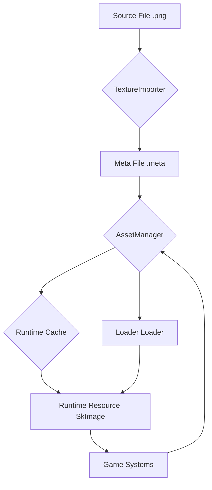

<div align="center">

# 🎮 Luma Engine

[Engine Architecture](ARCHITECTURE_EN.md)
[中文版本](README.md)

**A modern, modular, data-driven, high-performance real-time 2D game engine based on C++20 and C#, designed to be a powerful alternative to Unity 2D.**

</div>

-----

## Table of Contents

- [✨ Core Features & Performance Highlights](#-core-features--performance-highlights)
  - [🚀 Performance Comparison: Luma vs. Unity DOTS](#-performance-comparisonluma-vs-unity-dots)
  - [🌟 Key Features at a Glance](#-key-features-at-a-glance)
- [📖 Overview & Design Philosophy](#-overview--design-philosophy)
  - [🛠️ Tech Stack](#️-tech-stack)
- [🎯 Quick Start](#-quick-start)
  - [Environment & Dependencies](#environment--dependencies)
  - [🔧 Building the Luma Engine](#-building-the-luma-engine)
- [⚙️ Core Systems Deep Dive](#️-core-systems-deep-dive)
- [📊 Project Status & Roadmap](#-project-status--roadmap)
  - [✅ Completed Features](#-completed-features)
  - [🚀 Development Roadmap](#-development-roadmap)
- [🤝 Contributing Guide](#-contributing-guide)
  - [Code Style Guide](#code-style-guide)
  - [Submission Process](#submission-process)
- [📄 License](#-license)

-----

## ✨ Core Features & Performance Highlights

The Luma Engine is designed for extreme performance and a modern development experience. We believe that exceptional performance is the cornerstone of unleashing creativity.

### 🚀 Performance Comparison: Luma vs. Unity DOTS

Unity Version: 6.1 lts
On identical hardware, Luma demonstrates significant performance advantages in large-scale dynamic sprite rendering and physics simulation scenarios.

#### Scene Rendering Performance (Dynamic Sprites)

*Dynamically generating, moving, rotating, and scaling a large number of sprites within the view.*

| Entity Count       | Luma Engine (FPS) | Unity DOTS (FPS) | **Performance Multiplier** |
|:-------------------|:-----------------:|:----------------:|:--------------------------:|
| **100,000**        |     ~100 FPS      |     ~30 FPS      |          **~3.3×**         |
| **200,000**        |      ~50 FPS      |     ~15 FPS      |          **~3.3×**         |
| **1,000,000**      |      ~10 FPS      |      ~2 FPS      |          **~5.0×**         |

#### Physics Simulation Performance

*Real-time collision simulation for 10,000 dynamic physics rigid bodies (Box2D).*

| Metric           |     Luma Engine     |   Unity    | **Performance Multiplier** |
|:-----------------|:-------------------:|:----------:|:--------------------------:|
| **Total Frame Time** |   **2.40 ms**    | 45.45 ms   |          **18.9×**         |
| **Theoretical FPS**  | **~416 FPS**     | ~22 FPS    |          **18.9×**         |

### 🌟 Key Features at a Glance

<table>
<tr>
<td width="50%">

#### 🧩 **Modern ECS Architecture**

- Based on the industry-leading **EnTT** library for extreme-performance data access.
- Complete separation of logic and data, resulting in clear code structure that is easy to extend and maintain.

#### ⚡ **High-Performance Parallel Computing**

- Built-in `JobSystem` based on a **work-stealing** algorithm for dynamic load balancing, maximizing multi-core CPU performance.
- Provides full **C# JobSystem bindings**, allowing game logic to also benefit from parallelism.

</td>
<td width="50%">

#### ✨ **Visual Blueprint System**

- Powerful node-based editor for creating complex logic without writing code.
- **Directly generates high-performance C# code**, not runtime interpretation, ensuring no performance loss.
- Can call any C# function, supports custom functions and variables.

#### 🔗 **Seamless C++/C# Interop**

- Based on .NET 9 CoreCLR hosting, enabling stable and efficient bidirectional communication.
- **Script Hot Reload**: See the effects of C# code changes immediately without restarting the engine.

</td>
</tr>
</table>

-----

## 📖 Overview & Design Philosophy

The core goal of the Luma Engine is to provide 2D game developers with a development platform that combines extreme performance with a modern workflow. We adhere to the following design principles:

- **Data-Driven**: Everything in the engine (scenes, entities, components, animations) is data. This makes hot reloading, editor extensions, and procedural content generation extremely simple.
- **Modularity & Extensibility**: Each core system of the engine (rendering, physics, audio, etc.) is a highly decoupled module, facilitating independent upgrades, replacements, or extensions.
- **Performance First**: From the choice of ECS architecture to the design of the JobSystem, every decision prioritizes performance.

### 🛠️ Tech Stack

| Category          | Technology      | Version/Library       |
|:------------------|:----------------|:----------------------|
| **Core Language** | C++             | C++20 Standard        |
| **Scripting Language** | C#      | .NET 9 (CoreCLR)      |
| **Build System**  | CMake           | 3.21+                 |
| **ECS Framework** | EnTT            | latest                |
| **2D Physics**    | Box2D           | latest                |
| **Rendering Backend** | Skia + Dawn | Cross-platform Graphics API Wrapper |
| **Window & Input**| SDL3            | Cross-platform Window Management |
| **Editor UI**     | Dear ImGui      | Immediate Mode GUI Toolkit |
| **Data Serialization** | yaml-cpp/json | YAML/json Read/Write |

-----

## 🎯 Quick Start

First, clone this repository to your local machine:

```bash
git clone https://github.com/NGLSG/Luma.git
cd Luma
```

### Environment & Dependencies

Before starting the build, please ensure your system environment and all dependencies are correctly configured.

#### 1. Prerequisites

Please ensure you have the following system-level libraries and tools installed:

*   **Git**
*   **CMake** (Version **3.21** or higher)
*   **Vulkan SDK**
*   **C++ Compiler** (e.g., Visual Studio 2022 / GCC 11 / Clang 14)

#### 2. Dependency Management

Luma uses a combination of **CPM.cmake** and **Vcpkg** to manage third-party dependencies. This simplifies the process of fetching and building dependencies.

**Option A: Using Vcpkg (Recommended)**

1.  **Install Vcpkg**: If you haven't installed Vcpkg yet, please follow the [official guide](https://vcpkg.io/en/getting-started.html).
2.  **Configure CMake**: When configuring CMake, ensure you point to your Vcpkg toolchain file.

    ```bash
    # In the project root directory
    mkdir build
    cd build
    # Replace <path_to_vcpkg> with your Vcpkg installation path
    cmake .. -DCMAKE_TOOLCHAIN_FILE=<path_to_vcpkg>/scripts/buildsystems/vcpkg.cmake
    ```

    Vcpkg will automatically read the `vcpkg.json` manifest file in the project root, and download, compile, and install all listed dependencies.

**Option B: Using System Package Manager (Linux/macOS)**

For some common libraries (like CURL, OpenSSL), you can also use your system's package manager (e.g., `apt`, `brew`) to install them. Ensure you install the development packages (usually ending with `-dev` or `-devel`).

For example, on Ubuntu:

```bash
sudo apt install libssl-dev libcurl4-openssl-dev
```

CMake will prioritize system packages found via `find_package`.

**Option C: Using CPM.cmake**

For dependencies not provided by Vcpkg or the system package manager, the project uses CPM.cmake to download and build them directly from source repositories. This is built into the project's CMakeLists and requires no additional action.

#### 3. Special Dependencies: Skia and CoreCLR

`Skia` (graphics library) and `CoreCLR` (.NET runtime) require **manually downloading** precompiled binary packages.

1.  Go to the [Luma-External Releases](https://github.com/NGLSG/Luma-External/releases/tag/Prebuilt) page.
2.  Download the corresponding `.zip` package for your operating system.
  *   **CoreCLR**: `coreclr-win-x64.zip` (Windows) or `coreclr-linux-x64.zip` (Linux)
  *   **Skia**: `skia-win.zip` (Windows) or `skia-linux.zip` (Linux)
3.  Create an `External` folder in the project root directory (if it doesn't exist).
4.  **Extract** the downloaded `.zip` files into the `External` directory. After extraction, you should get folders like `skia-win/` and `coreclr-win-x64/`.

After completing these steps, your `External` directory structure should resemble:

```
Luma/
├── External/
│   ├── CMakeLists.txt
│   ├── coreclr-win-x64/    # Extracted CoreCLR
│   └── skia-win/           # Extracted Skia
└── ...
```

### 🔧 Building the Luma Engine

With all dependencies ready, you can build the project using CMake.

1.  **Configure the Project** (Example using Vcpkg):

    ```bash
    # In the project root directory
    mkdir build
    cd build
    # Replace E:\vcpkg with your actual Vcpkg installation path
    cmake .. -DCMAKE_TOOLCHAIN_FILE=E:\vcpkg\scripts\buildsystems\vcpkg.cmake
    ```

2.  **Compile the Project**:

    ```bash
    cmake --build . --config Release
    # Or compile within the generated Visual Studio solution
    ```

After successful compilation, the executable will be located in the corresponding subdirectory of the `build` directory (e.g., `build/bin/Release/`).

-----

## ⚙️ Core Systems Deep Dive

<details>
<summary><strong>📦 Asset & Resource System</strong></summary>

Luma employs a modern asset pipeline based on **GUIDs**. All source files in the `Assets/` directory are automatically processed, generating a `.meta` file containing a unique ID and import settings. At runtime, the `AssetManager` efficiently loads resources from disk or retrieves them from the cache based on the GUID, ensuring stable and efficient resource referencing.



</details>

<details>
<summary><strong>✨ Visual Blueprint System</strong></summary>

It not only provides an intuitive node editing experience but also completely eliminates the performance bottlenecks of traditional visual scripting by **directly generating C# source code**.

- **Workflow**: `Visual Blueprint Editing` -> `Save as .blueprint file` -> `C# Code Generator` -> `Generate .cs script` -> `Participate in project compilation` -> `Run at native performance`
- **Features**: Supports events, branches, loops, custom functions/variables, calling any external C# function, logic region comment boxes, and more.

</details>

<details>
<summary><strong>⚡ Physics & JobSystem</strong></summary>

Physics simulation is based on **Box2D** and runs in an independent loop with a **fixed timestep**, ensuring deterministic results. To handle interactions between a large number of physics objects, the physics world step calculation is encapsulated into a Job and distributed across multiple cores for parallel processing by the **JobSystem**, greatly improving performance.

The JobSystem itself is based on a **work-stealing** algorithm, capable of efficiently handling various balanced and unbalanced parallel computing tasks, and already provides a complete **C# API**.

</details>

<details>
<summary><strong>🎬 Animation, Tilemap, UI & Audio</strong></summary>

- **Animation State Machine**: Provides a powerful visual editor to create and manage 2D animation states (Idle, Run, Jump, etc.) and their transition conditions, easily controlled via C# API.
- **Tilemap System**: Similar to Unity's Tile Palette, supports standard and rule tiles, and even allows **Prefabs** to be used as brushes to paint game objects containing complex logic.
- **UI System**: Built on ECS, provides core components like `Text`, `Image`, `Button`, `InputText`, and has reserved support for `ScrollView`.
- **Audio System**: Based on **SDL3**, provides a high-performance audio manager supporting 3D spatial sound and dynamic multi-channel mixing.

</details>

-----

## 📊 Project Status & Roadmap

### ✅ Completed Features

- **Core**: Asset Pipeline, ECS, JobSystem, Animation State Machine, **Visual Blueprints**, Tilemap, UI, **Spatial Audio**
- **Features**: C# Script Hosting (Hot Reload), C++/C# Interop, Physics Integration
- **Tools**: Fully-featured Editor, Packaging Functionality, Profiler, Visual Physics Debugging

### 🚀 Development Roadmap

| Priority | Feature          | Status     | ETA         |
|:---------|:-----------------|:-----------|:------------|
| **Medium** | C-API Extension  | 📋 Planned | Q3 2025     |
| **Low**    | Modern UI Upgrade| 💭 Researching | Q4 2025 |
| **Low**    | Particle System  | 📋 Planned | Q4 2025     |

-----

## 🤝 Contributing Guide

We welcome all developers passionate about game engine development to join the Luma project!

### Code Style Guide

- **Naming**: `PascalCase` for types and functions, `camelCase` for variables.
- **Comments**: The project uses **Doxygen** style; all public APIs require complete comments.

### Submission Process

1.  **Fork** this repository and create your feature branch from `master`.
2.  Write your code, ensuring it follows the project's style guide.
3.  Submit a **Pull Request** with a detailed description of your changes.

-----

<div align="center">

## 📄 License

This project is open source under the [MIT License](LICENSE).

</div>