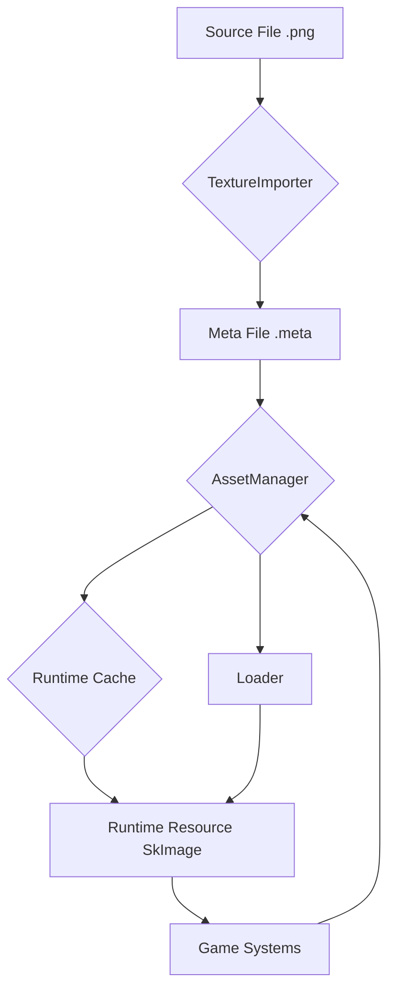

<div align="center">

# 🎮 Luma Engine

[Engine Architecture](ARCHITECTURE_EN.md)
[中文版本](README.md)

**A modern, modular, data-driven high-performance real-time 2D game engine based on C++20 and C#, designed to be a powerful alternative to Unity 2D.**

</div>

-----

## Table of Contents

- [✨ Core Features & Performance Highlights](#-core-features--performance-highlights)
  - [🚀 Performance Comparison: Luma vs. Unity DOTS](#-performance-comparison-luma-vs-unity-dots)
  - [🌟 Key Features at a Glance](#-key-features-at-a-glance)
- [📖 Overview & Design Philosophy](#-overview--design-philosophy)
  - [🛠️ Tech Stack](#️-tech-stack)
- [🎯 Quick Start](#-quick-start)
  - [Environment & Dependencies](#environment--dependencies)
  - [🔧 Building the Luma Engine](#-building-the-luma-engine)
- [⚙️ Core Systems Deep Dive](#️-core-systems-deep-dive)
- [📊 Project Status & Roadmap](#-project-status--roadmap)
  - [✅ Completed Features](#-completed-features)
  - [🚀 Development Roadmap](#-development-roadmap)
- [🤝 Contribution Guide](#-contribution-guide)
  - [Code Style](#code-style)
  - [Submission Process](#submission-process)
- [📄 License](#-license)

-----

## ✨ Core Features & Performance Highlights

The Luma Engine is designed for ultimate performance and a modern development experience. We believe that exceptional performance is the cornerstone of unleashing creativity.

### 🚀 Performance Comparison: Luma vs. Unity DOTS

Unity Version: 6.1 lts
On identical hardware, Luma demonstrates significant performance advantages in both large-scale dynamic sprite rendering and physics simulation scenarios.

#### Scene Rendering Performance (Dynamic Sprites)

*Dynamically generating, moving, rotating, and scaling a large number of sprites within the view.*

| Entity Count        | Luma Engine (FPS) | Unity DOTS (FPS) | **Performance Multiplier** |
|:--------------------|:-----------------:|:----------------:|:--------------------------:|
| **100,000**         |     ~100 FPS      |     ~30 FPS      |          **~3.3×**         |
| **200,000**         |      ~50 FPS      |     ~15 FPS      |          **~3.3×**         |
| **1,000,000**       |      ~10 FPS      |      ~2 FPS      |          **~5.0×**         |

#### Physics Simulation Performance

*Real-time collision simulation for 10,000 dynamic physics rigid bodies (Box2D).*

| Metric          |     Luma Engine     |   Unity    | **Performance Multiplier** |
|:----------------|:-------------------:|:----------:|:--------------------------:|
| **Total Frame Time** |    **2.40 ms**     | 45.45 ms   |          **18.9×**         |
| **Theoretical FPS**  |   **~416 FPS**     | ~22 FPS    |          **18.9×**         |

### 🌟 Key Features at a Glance

<table>
<tr>
<td width="50%">

#### 🧩 **Modern ECS Architecture**

- Based on the industry-leading **EnTT** library for ultimate data access performance.
- Complete separation of logic and data, resulting in clear code structure, easy extension, and maintenance.

#### ⚡ **High-Performance Parallel Computing**

- Built-in **work-stealing** algorithm-based `JobSystem` for dynamic load balancing, maximizing multi-core CPU performance.
- Provides complete **C# JobSystem bindings**, allowing game logic to also benefit from parallelism.

</td>
<td width="50%">

#### ✨ **Visual Blueprint System**

- Powerful node-based editor for creating complex logic without coding.
- **Directly generates high-performance C# code**, not runtime interpretation, ensuring no performance loss.
- Can call any C# function, supports custom functions and variables.

#### 🔗 **Seamless C++/C# Interoperability**

- Based on .NET 9 CoreCLR hosting for stable and efficient bidirectional communication.
- **Script Hot Reload**: See changes in C# code immediately without restarting the engine.

</td>
</tr>
</table>

-----

## 📖 Overview & Design Philosophy

The core goal of the Luma Engine is to provide 2D game developers with a development platform that combines ultimate performance with a modern workflow. We adhere to the following design principles:

- **Data-Driven**: Everything in the engine (scenes, entities, components, animations) is data. This makes hot reloading, editor extensions, and procedural content generation extremely simple.
- **Modularity & Extensibility**: Each core system of the engine (rendering, physics, audio, etc.) is a highly decoupled module, facilitating independent upgrades, replacements, or extensions.
- **Performance First**: From the choice of ECS architecture to the design of the JobSystem, every decision prioritizes performance.

### 🛠️ Tech Stack

| Category          | Technology       | Version/Library        |
|:------------------|:-----------------|:-----------------------|
| **Core Language** | C++              | C++20 Standard         |
| **Scripting Language** | C#       | .NET 9 (CoreCLR)       |
| **Build System**  | CMake            | 3.21+                  |
| **ECS Framework** | EnTT             | latest                 |
| **2D Physics**    | Box2D            | latest                 |
| **Rendering Backend** | Skia + Dawn | Cross-platform Graphics API Wrapper |
| **Window & Input** | SDL3            | Cross-platform Window Management    |
| **Editor UI**     | Dear ImGui       | Immediate Mode GUI Toolkit          |
| **Data Serialization** | yaml-cpp/json | YAML/json Read/Write   |

-----

## 🎯 Quick Start

First, clone this repository to your local machine:

```bash
git clone https://github.com/NGLSG/Luma.git
cd Luma
```

### Environment & Dependencies

Before starting the build, please ensure your system environment and all dependencies are correctly configured.

#### 1. Prerequisites

Please ensure you have installed the following system-level libraries and tools:

*   **Git**
*   **CMake** (Version **3.21** or higher)
*   **Vulkan SDK**
*   **LibCurl**
*   **OpenSSL**
*   **C++ Compiler** (e.g., Visual Studio 2022 / GCC 11 / Clang 14)

> **Note**: Dependencies like LibCurl, OpenSSL, and the Vulkan SDK can be installed using package managers, e.g., `apt` on Ubuntu, `vcpkg` or `choco` on Windows.

#### 2. Download Dependencies

All third-party libraries need to be placed in the `External` folder at the project root. Please follow these steps:

**Step 1: Create the `External` Directory**

If the `External` directory does not exist, create it in the project root.

```bash
mkdir External
cd External
```

**Step 2: Clone Source Repositories**

Clone all the following libraries into the `External` directory.

| Library               | Repository URL                                      |
| :-------------------- | :-------------------------------------------------- |
| `astc-encoder`        | `https://github.com/ARM-software/astc-encoder.git`  |
| `box2d`               | `https://github.com/erincatto/box2d.git`            |
| `entt`                | `https://github.com/skypjack/entt.git`              |
| `glm`                 | `https://github.com/g-truc/glm.git`                 |
| `imgui`               | `https://github.com/ocornut/imgui.git`              |
| `imgui-node-editor`   | `https://github.com/thedmd/imgui-node-editor.git`   |
| `ImGuizmo`            | `https://github.com/CedricGuillemet/ImGuizmo.git`   |
| `json`                | `https://github.com/nlohmann/json.git`              |
| `llama-cpp`           | `https://github.com/ggerganov/llama.cpp.git`        |
| `SDL`                 | `https://github.com/libsdl-org/SDL.git`             |
| `yaml-cpp`            | `https://github.com/jbeder/yaml-cpp.git`            |

You can use the following script to clone all repositories at once:

```bash
git clone https://github.com/ARM-software/astc-encoder.git
git clone https://github.com/erincatto/box2d.git
git clone https://github.com/skypjack/entt.git
git clone https://github.com/g-truc/glm.git
git clone https://github.com/ocornut/imgui.git
git clone https://github.com/thedmd/imgui-node-editor.git
git clone https://github.com/CedricGuillemet/ImGuizmo.git
git clone https://github.com/nlohmann/json.git
git clone https://github.com/ggerganov/llama.cpp.git
git clone https://github.com/libsdl-org/SDL.git
git clone https://github.com/jbeder/yaml-cpp.git
```

**Step 3: Download and Extract Binary Dependencies**

`CoreCLR` and `Skia` are provided as precompiled binary packages.

1.  Go to the [Luma-External Releases](https://github.com/NGLSG/Luma-External/releases/tag/Prebuilt) page.
2.  Download the corresponding `.zip` package for your operating system. For example, Windows users need to download `skia-win.zip` and `coreclr-win-x64.zip`.
3.  **Extract** the downloaded `.zip` files into the `External` directory.

| Binary Package   | OS              | Download File             |
| :--------------- | :-------------- | :------------------------ |
| `coreclr`        | Linux (x64)     | `coreclr-linux-x64.zip`   |
| `coreclr`        | Windows (x64)   | `coreclr-win-x64.zip`     |
| `skia`           | Linux           | `skia-linux.zip`          |
| `skia`           | Windows         | `skia-win.zip`            |

**Step 4: Configure Dependency Build File**

This is a crucial step. You need to **move** the `ExternalCMakeLists.txt` file from the project **root directory** to the `External` directory and **rename** it to `CMakeLists.txt`.

Execute the following command in the project **root directory**:

```bash
# For Linux / macOS / Git Bash
mv ExternalCMakeLists.txt External/CMakeLists.txt

# For Windows CMD
# move ExternalCMakeLists.txt External\CMakeLists.txt
```

After completing the above steps, your `External` directory structure should look like this:

```
Luma/
├── External/
│   ├── CMakeLists.txt      <-- File moved and renamed from root
│   ├── astc-encoder/
│   ├── box2d/
│   ├── coreclr-win-x64/    <-- Extracted directory
│   ├── entt/
│   ├── glm/
│   ├── imgui/
│   ├── ... (other cloned libs)
│   └── skia-win/           <-- Extracted directory
└── ... (other project files)
```

### 🔧 Building the Luma Engine

With all dependencies ready, you can build the project using CMake.

Execute the following commands in the project root directory:

```bash
# 1. Create a build directory and enter it
mkdir build
cd build

# 2. Run CMake to configure the project
cmake ..

# 3. Start the compilation
# On Windows (Visual Studio), this generates a .sln file; open it in VS to build
# On Linux (Makefiles), you can directly run the build command
cmake --build .
```

After successful compilation, the executable will be located in the corresponding subdirectory within the `build` directory.

-----

## ⚙️ Core Systems Deep Dive

<details>
<summary><strong>📦 Asset & Resource System</strong></summary>

Luma employs a modern asset pipeline based on **GUIDs**. All source files in the `Assets/` directory are automatically processed, generating a `.meta` file containing a unique ID and import settings. At runtime, the `AssetManager` efficiently loads resources from disk or retrieves them from the cache based on the GUID, ensuring stable and efficient resource referencing.



</details>

<details>
<summary><strong>✨ Visual Blueprint System</strong></summary>

It not only provides an intuitive node editing experience but also eliminates the performance bottlenecks of traditional visual scripting by **directly generating C# source code**.

- **Workflow**: `Visual Blueprint Editing` -> `Save as .blueprint file` -> `C# Code Generator` -> `Generate .cs script` -> `Participate in project compilation` -> `Run at native performance`
- **Features**: Supports events, branches, loops, custom functions/variables, calling any external C# function, logic region comment boxes, and more.

</details>

<details>
<summary><strong>⚡ Physics & JobSystem</strong></summary>

Physics simulation is based on **Box2D**, running in an independent loop with a **fixed timestep**, ensuring deterministic results. To handle interactions between a large number of physics objects, the physics world step calculation is encapsulated into a Job and distributed across multiple cores for parallel processing by the **JobSystem**, significantly improving performance.

The JobSystem itself is based on a **work-stealing** algorithm, efficiently handling various balanced and unbalanced parallel computing tasks, and already provides a complete **C# API**.

</details>

<details>
<summary><strong>🎬 Animation, Tilemap, UI & Audio</strong></summary>

- **Animation State Machine**: Provides a powerful visual editor to create and manage 2D animation states (Idle, Run, Jump, etc.) and their transition conditions, easily controlled via C# API.
- **Tilemap System**: Similar to Unity's Tile Palette, supports standard, rule tiles, and even allows **Prefabs** to be used as brushes to paint game objects containing complex logic.
- **UI System**: Built on ECS, provides core components like `Text`, `Image`, `Button`, `InputText`, with support for `ScrollView` planned.
- **Audio System**: Based on **SDL3**, provides a high-performance audio manager supporting 3D spatial sound and dynamic multi-channel mixing.

</details>

-----

## 📊 Project Status & Roadmap

### ✅ Completed Features

- **Core**: Asset Pipeline, ECS, JobSystem, Animation State Machine, **Visual Blueprints**, Tilemap, UI, **Spatial Audio**
- **Features**: C# Script Hosting (Hot Reload), C++/C# Interop, Physics Integration
- **Tools**: Fully-featured Editor, Packaging Functionality, Profiler, Visual Physics Debugging

### 🚀 Development Roadmap

| Priority  | Feature             | Status      | ETA         |
| :-------- | :------------------ | :---------- | :---------- |
| **Medium**| C-API Extension     | 📋 Planned  | Q3 2025     |
| **Low**   | Modern UI Upgrade   | 💭 Researching | Q4 2025     |
| **Low**   | Particle System     | 📋 Planned  | Q4 2025     |

-----

## 🤝 Contribution Guide

We welcome all developers passionate about game engine development to join the Luma project!

### Code Style

- **Naming**: `PascalCase` for types and functions, `camelCase` for variables.
- **Comments**: The project uses **Doxygen** style; all public APIs require complete comments.

### Submission Process

1.  **Fork** this repository and create your feature branch from `master`.
2.  Write code ensuring it follows the project style.
3.  Submit a **Pull Request** with a detailed description of your changes.

-----

<div align="center">

## 📄 License

This project is open source under the [MIT License](LICENSE).

</div>